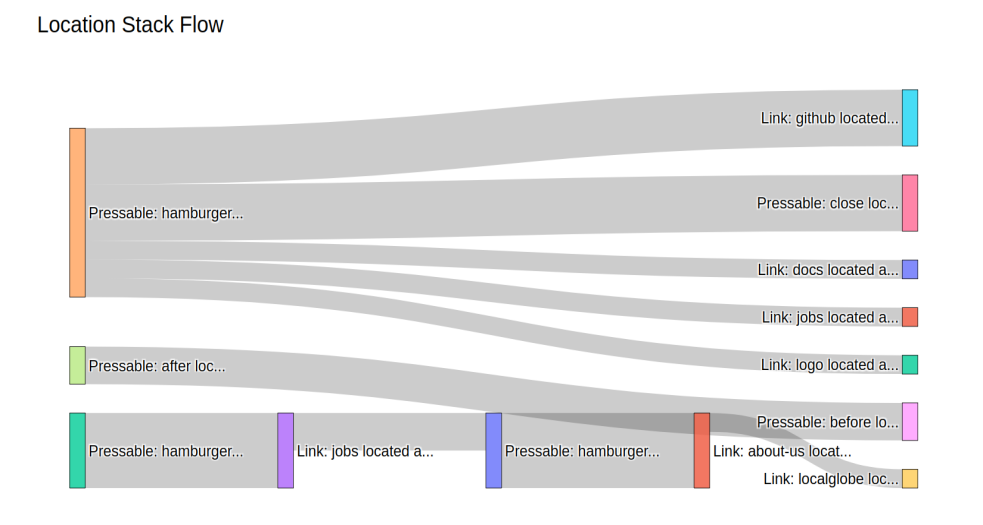

.. _funnel_discovery:

.. frontmatterposition:: 4

.. currentmodule:: bach

================
Funnel Discovery
================

This example notebook shows how to use the 'Funnel Discovery' model on your data collected with Objectiv. 
It's also available as a `full Jupyter notebook 
<https://github.com/objectiv/objectiv-analytics/blob/main/notebooks/funnel-discovery.ipynb>`_
to run on your own data (see how to :doc:`get started in your notebook <../get-started-in-your-notebook>`), 
or you can instead `run the Demo </docs/home/try-the-demo/>`_ to quickly try it out. The dataset used 
here is the same as in the Demo.

In classical funnel analysis you predefine the steps, and then you analyze the differences for user 
attributes or behavior in each step.

However, this means you have to make assumptions about which steps matter, and you potentially miss important, 
impactful flows, e.g. because they are not very obvious or still small. Yet these can represent major 
opportunities to boost or optimize.

This is where Funnel Discovery comes in: to discover all the (top) user journeys that lead to conversion or 
drop-off, and run subsequent analyses on them.

In particular, we will discover in this example:

* The most popular consecutive steps overall;
* The steps/flows which lead to conversion;
* The most common drop-offs;
* The user journeys from marketing campaigns;
* Etcetera.

Get started
-----------
We first have to instantiate the model hub and an Objectiv DataFrame object.

.. doctest::
	:skipif: engine is None

	>>> # set the timeframe of the analysis
	>>> start_date = '2022-02-01'
	>>> end_date = None

.. we override the timeframe for the doctests below
	
.. testsetup:: funnel-discovery
	:skipif: engine is None

	start_date = '2022-02-01'
	end_date = '2022-06-30'
	pd.set_option('display.max_colwidth', 93)

.. doctest:: funnel-discovery
	:skipif: engine is None

	>>> # instantiate the model hub, and set the default time aggregation to daily
	>>> # and set the global contexts that will be used in this example
	>>> from modelhub import ModelHub
	>>> modelhub = ModelHub(time_aggregation='%Y-%m-%d', global_contexts=['application', 'marketing'])
	>>> # get an Objectiv DataFrame within a defined timeframe
	>>> df = modelhub.get_objectiv_dataframe(db_url=DB_URL, start_date=start_date, end_date=end_date)

The `location_stack` column, and the columns taken from the global contexts, contain most of the 
event-specific data. These columns are JSON typed, and we can extract data from it using the keys of the JSON 
objects with :doc:`SeriesLocationStack 
<../open-model-hub/api-reference/SeriesLocationStack/modelhub.SeriesLocationStack>` methods, or the `context` 
accessor for global context columns. See the :doc:`open taxonomy example <./open-taxonomy>` for how to use 
the `location_stack` and global contexts.

.. doctest:: funnel-discovery
	:skipif: engine is None

	>>> # add specific contexts to the data as columns
	>>> df['application_id'] = df.application.context.id
	>>> df['feature_nice_name'] = df.location_stack.ls.nice_name

.. doctest:: funnel-discovery
	:skipif: engine is None

	>>> # select which event type to use for further analysis - PressEvents to focus on what users directly interact with
	>>> df = df[df['event_type'] == 'PressEvent']

.. admonition:: Reference
	:class: api-reference

	* :doc:`modelhub.ModelHub <../open-model-hub/api-reference/ModelHub/modelhub.ModelHub>`
	* :doc:`modelhub.ModelHub.get_objectiv_dataframe <../open-model-hub/api-reference/ModelHub/modelhub.ModelHub.get_objectiv_dataframe>`
	* :ref:`using global context data <location-stack-and-global-contexts>`
	* :doc:`modelhub.SeriesLocationStack.ls <../open-model-hub/api-reference/SeriesLocationStack/modelhub.SeriesLocationStack.ls>`

First: define what is conversion
--------------------------------
As a prerequisite for Funnel Discovery, define the events you see as conversion.

In this example we will view someone as converted when they go on to read the documentation from our website, 
but you can 
:doc:`use any event <../open-model-hub/api-reference/ModelHub/modelhub.ModelHub.add_conversion_event>`.

.. doctest:: funnel-discovery
	:skipif: engine is None

	>>> # define which data to use as conversion events; in this example, anyone who goes on to read the documentation
	>>> df['is_conversion_event'] = False
	>>> df.loc[df['application_id'] == 'objectiv-docs', 'is_conversion_event'] = True

Out of curiosity, let's see which features are used by users that converted, sorted by their conversion impact.

.. doctest:: funnel-discovery
	:skipif: engine is None

	>>> # calculate the percentage of converted users per feature: (converted users per feature) / (total users converted)
	>>> total_converted_users = df[df['is_conversion_event']]['user_id'].unique().count().value
	>>> top_conversion_locations = modelhub.agg.unique_users(df[df['is_conversion_event']], groupby='feature_nice_name')
	>>> top_conversion_locations = (top_conversion_locations / total_converted_users) * 100
	>>> 
	>>> # show the results, with .to_frame() for nicer formatting
	>>> top_conversion_locations = top_conversion_locations.to_frame().rename(columns={'unique_users': 'converted_users_percentage'})
	>>> top_conversion_locations.sort_values(by='converted_users_percentage', ascending=False).head()
	                                                                                   converted_users_percentage
	feature_nice_name
	Link: Quickstart Guide located at Root Location: home => Navigation: docs-sidebar                   15.946844
	Link: logo located at Root Location: home => Navigation: navbar-top                                 10.797342
	Link: Tracking located at Root Location: home => Navigation: navbar-top                             10.631229
	Link: Taxonomy located at Root Location: modeling => Navigation: navbar-top                         10.299003
	Link: Modeling located at Root Location: tracking => Navigation: navbar-top                         9.966777

.. admonition:: Reference
	:class: api-reference

	* :doc:`bach.Series.unique <../bach/api-reference/Series/bach.Series.unique>`
	* :doc:`bach.DataFrame.count <../bach/api-reference/DataFrame/bach.DataFrame.count>`
	* :doc:`modelhub.Aggregate.unique_users <../open-model-hub/models/aggregation/modelhub.Aggregate.unique_users>`
	* :doc:`bach.Series.to_frame <../bach/api-reference/Series/bach.Series.to_frame>`
	* :doc:`bach.DataFrame.rename <../bach/api-reference/DataFrame/bach.DataFrame.rename>`
	* :doc:`bach.DataFrame.sort_values <../bach/api-reference/DataFrame/bach.DataFrame.sort_values>`
	* :doc:`bach.DataFrame.head <../bach/api-reference/DataFrame/bach.DataFrame.head>`

See step sequences per user
---------------------------
Before we see what helped conversion and what didn't, let's have a look at which consecutive steps each user 
took (aka the features they used) in general, after starting their session, based on the 
`location stack <https://objectiv.io/docs/tracking/core-concepts/locations>`_. We have to specify the maximum 
n steps, and use the :doc:`get_navigation_paths 
<../open-model-hub/models/funnels/FunnelDiscovery/modelhub.FunnelDiscovery.get_navigation_paths>` operation.

.. doctest:: funnel-discovery
	:skipif: engine is None

	>>> # instantiate the FunnelDiscovery model from the open model hub
	>>> funnel = modelhub.get_funnel_discovery()
	>>> # set the maximum n steps
	>>> max_steps = 4

.. doctest:: funnel-discovery
	:skipif: engine is None

	>>> # for every user starting their session, find all maximum n consecutive steps they took
	>>> df_steps = funnel.get_navigation_paths(df, steps=max_steps, by='user_id')
	>>> df_steps.head()
	                                                                    location_stack_step_1	                            location_stack_step_2	                            location_stack_step_3	                            location_stack_step_4
	user_id
	0000bb2f-66e9-4e48-8e2f-7d0a82446ef4 	Link: about-us located at Root Location: home ... 	Link: logo located at Root Location: about => ...	                                             None	                                             None
	00529837-d672-4747-9b87-fd09f2919326 	Link: blog located at Root Location: home => N... 	Link: docs located at Root Location: blog => N... 	Link: bach-and-sklearn located at Root Locatio... 	Link: basic-product-analytics located at Root ...
	00529837-d672-4747-9b87-fd09f2919326 	Link: docs located at Root Location: blog => N... 	Link: bach-and-sklearn located at Root Locatio... 	Link: basic-product-analytics located at Root ...	                                             None
	00529837-d672-4747-9b87-fd09f2919326 	Link: bach-and-sklearn located at Root Locatio... 	Link: basic-product-analytics located at Root ...	                                             None	                                             None
	00529837-d672-4747-9b87-fd09f2919326 	Link: spin-up-the-demo located at Root Locatio... 	Link: blog located at Root Location: home => N... 	Link: docs located at Root Location: blog => N... 	Link: bach-and-sklearn located at Root Locatio...

.. admonition:: Reference
	:class: api-reference

	* :doc:`modelhub.FunnelDiscovery.get_navigation_paths <../open-model-hub/models/funnels/FunnelDiscovery/modelhub.FunnelDiscovery.get_navigation_paths>`
	* :doc:`modelhub.ModelHub.get_funnel_discovery <../open-model-hub/api-reference/ModelHub/modelhub.ModelHub.get_funnel_discovery>`
	* :doc:`bach.DataFrame.head <../bach/api-reference/DataFrame/bach.DataFrame.head>`

See top step sequences for all users
------------------------------------
For the bigger picture, calculate the most frequent consecutive steps that all users took after starting 
their session, based on the `location stack <https://objectiv.io/docs/tracking/core-concepts/locations>`_.

.. doctest:: funnel-discovery
	:skipif: engine is None

	>>> df_steps.value_counts().to_frame().head(20)
	                                                                                                                                                                                                                                                                                                                                                                                         value_counts
	location_stack_step_1                                                                         location_stack_step_2                                                                         location_stack_step_3                                                                         location_stack_step_4                                                     
	Pressable: after located at Root Location: home => Content: capture-data => Content: data-... NaN                                                                                           NaN                                                                                           NaN                                                                                                      87
	Pressable: before located at Root Location: home => Content: capture-data => Content: data... Pressable: after located at Root Location: home => Content: capture-data => Content: data-... NaN                                                                                           NaN                                                                                                      49
	Pressable: after located at Root Location: home => Content: capture-data => Content: data-... Pressable: before located at Root Location: home => Content: capture-data => Content: data... NaN                                                                                           NaN                                                                                                      48
	Link: about-us located at Root Location: home => Navigation: navbar-top                       NaN                                                                                           NaN                                                                                           NaN                                                                                                      48
	Pressable: hamburger located at Root Location: home => Navigation: navbar-top                 NaN                                                                                           NaN                                                                                           NaN                                                                                                      48
	Pressable: after located at Root Location: home => Content: capture-data => Content: data-... Pressable: after located at Root Location: home => Content: modeling => Content: modeling-... NaN                                                                                           NaN                                                                                                      46
	                                                                                              Pressable: before located at Root Location: home => Content: capture-data => Content: data... Pressable: after located at Root Location: home => Content: capture-data => Content: data-... Pressable: before located at Root Location: home => Content: capture-data => Content: data...            39
	Pressable: after located at Root Location: home => Content: modeling => Content: modeling-... Pressable: before located at Root Location: home => Content: modeling => Content: modeling... NaN                                                                                           NaN                                                                                                      35
	Pressable: before located at Root Location: home => Content: modeling => Content: modeling... Pressable: after located at Root Location: home => Content: modeling => Content: modeling-... NaN                                                                                           NaN                                                                                                      31
	Link: logo located at Root Location: blog => Navigation: navbar-top                           NaN                                                                                           NaN                                                                                           NaN                                                                                                      30
	Pressable: after located at Root Location: home => Content: modeling => Content: modeling-... NaN                                                                                           NaN                                                                                           NaN                                                                                                      29
	Pressable: before located at Root Location: home => Content: capture-data => Content: data... Pressable: after located at Root Location: home => Content: capture-data => Content: data-... Pressable: before located at Root Location: home => Content: capture-data => Content: data... Pressable: after located at Root Location: home => Content: capture-data => Content: data-...            29
	Pressable: after located at Root Location: home => Content: capture-data => Content: data-... Pressable: before located at Root Location: home => Content: capture-data => Content: data... Pressable: after located at Root Location: home => Content: capture-data => Content: data-... NaN                                                                                                      28
	                                                                                                                                                                                                                                                                                          Pressable: after located at Root Location: home => Content: modeling => Content: modeling-...            25
	Link: spin-up-the-demo located at Root Location: home => Content: hero                        NaN                                                                                           NaN                                                                                           NaN                                                                                                      24
	Link: about-us located at Root Location: home => Navigation: navbar-top                       Link: blog located at Root Location: about => Navigation: navbar-top                          Link: jobs located at Root Location: blog => Navigation: navbar-top                           Link: faq located at Root Location: jobs => Navigation: navbar-top                                       22
	Pressable: hamburger located at Root Location: home => Navigation: navbar-top                 Link: github located at Root Location: home => Navigation: navbar-top => Overlay: hamburge... NaN                                                                                           NaN                                                                                                      22
	Link: Overview located at Root Location: docs => Navigation: docs-sidebar => Expandable: A... Link: Overview located at Root Location: docs => Navigation: docs-sidebar => Expandable: A... Link: Overview located at Root Location: docs => Navigation: docs-sidebar => Expandable: A... Link: Overview located at Root Location: docs => Navigation: docs-sidebar => Expandable: A...            21
	Pressable: hamburger located at Root Location: home => Navigation: navbar-top                 Link: jobs located at Root Location: home => Navigation: navbar-top => Overlay: hamburger-... NaN                                                                                           NaN                                                                                                      21
	Link: star-us located at Root Location: home => Content: hero                                 NaN                                                                                           NaN                                                                                           NaN                                                                                                      20

.. admonition:: Reference
	:class: api-reference

	* :doc:`bach.DataFrame.value_counts <../bach/api-reference/DataFrame/bach.DataFrame.value_counts>`
	* :doc:`bach.Series.to_frame <../bach/api-reference/Series/bach.Series.to_frame>`
	* :doc:`bach.DataFrame.head <../bach/api-reference/DataFrame/bach.DataFrame.head>`

See step sequences that lead to conversion
------------------------------------------
Now let's find the sequences that actually lead to conversion.

First, see which step resulted in conversion to the dataframe, which will be `NaN` for sequences that did not 
convert.

.. doctest:: funnel-discovery
	:skipif: engine is None

	>>> # add which step resulted in conversion to the dataframe, with the `add_conversion_step_column` param
	>>> df_first_conversion_step = funnel.get_navigation_paths(df, steps=max_steps, by='user_id', add_conversion_step_column=True)
	>>> df_first_conversion_step.head(10)
	                                        location_stack_step_1                                   location_stack_step_2                                   location_stack_step_3                                   location_stack_step_4                                   _first_conversion_step_number
	user_id
	0000bb2f-66e9-4e48-8e2f-7d0a82446ef4 	Link: about-us located at Root Location: home ... 	Link: logo located at Root Location: about => ... 	None 	                                                None 	                                            	NaN
	00529837-d672-4747-9b87-fd09f2919326 	Link: docs located at Root Location: blog => N... 	Link: bach-and-sklearn located at Root Locatio... 	Link: basic-product-analytics located at Root ... 	None 	                                                2.0
	00529837-d672-4747-9b87-fd09f2919326 	Link: blog located at Root Location: home => N... 	Link: docs located at Root Location: blog => N... 	Link: bach-and-sklearn located at Root Locatio... 	Link: basic-product-analytics located at Root ...	3.0
	00529837-d672-4747-9b87-fd09f2919326 	Pressable: after located at Root Location: hom... 	Link: spin-up-the-demo located at Root Locatio... 	Link: blog located at Root Location: home => N... 	Link: docs located at Root Location: blog => N... 	NaN
	00529837-d672-4747-9b87-fd09f2919326 	Link: spin-up-the-demo located at Root Locatio... 	Link: blog located at Root Location: home => N... 	Link: docs located at Root Location: blog => N... 	Link: bach-and-sklearn located at Root Locatio... 	4.0
	00529837-d672-4747-9b87-fd09f2919326 	Link: blog located at Root Location: home => N... 	Pressable: after located at Root Location: hom... 	Link: spin-up-the-demo located at Root Locatio... 	Link: blog located at Root Location: home => N... 	NaN
	00529837-d672-4747-9b87-fd09f2919326 	Link: bach-and-sklearn located at Root Locatio... 	Link: basic-product-analytics located at Root ... 	None 	                                                None	                                                1.0
	005aa19c-7e80-4960-928c-a0853355ee5f 	Link: check-out-thijs-obj-on-github located at... 	Link: jobs located at Root Location: about => ... 	None 	                                                None	                                                NaN
	007f5fd7-7535-434e-aa3e-3d52f06d63ce 	Link: Modeling located at Root Location: home ... 	Link: Modeling feature importance located at R... 	Link: docs located at Root Location: home => N... 	Link: Modeling located at Root Location: home ... 	1.0
	007f5fd7-7535-434e-aa3e-3d52f06d63ce 	Link: docs located at Root Location: home => N... 	Link: Modeling located at Root Location: home ... 	Link: Modeling feature importance located at R... 	Link: docs located at Root Location: home => N... 	2.0

To filter down to all sequences that have actually converted, use the `only_converted_paths` parameter.

.. doctest:: funnel-discovery
	:skipif: engine is None

	>>> # filter down to all sequences that have actually converted with the `only_converted_paths` param
	>>> df_steps_till_conversion = funnel.get_navigation_paths(df, steps=max_steps, by='user_id', add_conversion_step_column=True, only_converted_paths=True)
	>>> df_steps_till_conversion.head(5)  
	                                        location_stack_step_1                                   location_stack_step_2                                   location_stack_step_3                                   location_stack_step_4	                                    _first_conversion_step_number
	user_id          
	00529837-d672-4747-9b87-fd09f2919326 	Link: spin-up-the-demo located at Root Locatio... 	Link: blog located at Root Location: home => N... 	Link: docs located at Root Location: blog => N... 	Link: bach-and-sklearn located at Root Locatio...	    4
	00529837-d672-4747-9b87-fd09f2919326 	Link: docs located at Root Location: blog => N... 	Link: bach-and-sklearn located at Root Locatio... 	None 	                                                None	                                                    2
	00529837-d672-4747-9b87-fd09f2919326 	Link: blog located at Root Location: home => N... 	Link: docs located at Root Location: blog => N... 	Link: bach-and-sklearn located at Root Locatio... 	None	                                                    3
	007f5fd7-7535-434e-aa3e-3d52f06d63ce 	Link: docs located at Root Location: home => N... 	Link: Modeling located at Root Location: home ... 	None 	                                                None	                                                    2
	007f5fd7-7535-434e-aa3e-3d52f06d63ce 	Link: docs located at Root Location: home => N... 	Link: Modeling located at Root Location: home ... 	None 	                                                None	                                                    2

We can use this to for instance see which sequences converted on the 4th step.

.. doctest:: funnel-discovery
	:skipif: engine is None

	>>> # filter down to sequences that converted on the 4th step
	>>> condition_convert_on_step_4 = df_steps_till_conversion['_first_conversion_step_number'] == 4
	>>> df_steps_till_conversion[condition_convert_on_step_4].head()
	                                        location_stack_step_1	                                location_stack_step_2	                                location_stack_step_3	                                location_stack_step_4	                                _first_conversion_step_number
	user_id          
	00529837-d672-4747-9b87-fd09f2919326 	Link: spin-up-the-demo located at Root Locatio... 	Link: blog located at Root Location: home => N... 	Link: docs located at Root Location: blog => N... 	Link: bach-and-sklearn located at Root Locatio... 	4
	01891784-6333-40f1-8be6-739f3adfdb97 	Link: about-us located at Root Location: home ... 	Pressable: hamburger located at Root Location:... 	Link: faq located at Root Location: home => Na... 	Pressable: navbar-toggle located at Root Locat... 	4
	02f197f4-90d1-4374-b8a5-89e2e91310d7 	Pressable: after located at Root Location: hom... 	Pressable: before located at Root Location: ho... 	Pressable: after located at Root Location: hom... 	Link: logo located at Root Location: modeling ... 	4
	05bd4058-b7df-4476-8174-dcf0be107b5c 	Link: blog located at Root Location: home => N... 	Link: jobs located at Root Location: blog => N... 	Link: faq located at Root Location: jobs => Na... 	Link: Objectiv.io located at Root Location: ho... 	4
	0605440c-1eba-479a-9000-8294576199aa 	Link: check-out-jansenbob-on-github located at... 	Link: blog located at Root Location: about => ... 	Link: read-more located at Root Location: blog... 	Link: MediaEvent located at Root Location: tax... 	4

Visualize these sequences in a Sankey diagram
~~~~~~~~~~~~~~~~~~~~~~~~~~~~~~~~~~~~~~~~~~~~~
We can use a Sankey diagram to visualize these customer journeys that lead to conversion (or drop-off). This 
helps you to select which sequences are most interesting to analyze further.

Let's plot it for the example above, where we filtered down to the sequences that converted on the 4th step. 
The width of each link represents the amount of times that flow was used, and you can hover over each link to 
see the source and target node.

.. do not doctest the code block below, as it generates a Sankey diagram that tries to display, but doesn't find a TTY and thus errors out
	
.. code-block:: jupyter-notebook
	
	>>> # plot the Sankey diagram using the top 15 examples via the `n_top_examples` param
	>>> funnel.plot_sankey_diagram(df_steps_till_conversion[condition_convert_on_step_4], n_top_examples=15)

.. image:: ../img/docs/example-notebooks/funnel-discovery-plot-sankey-4th-step.png
  :alt: Funnel Discovery Sankey diagram for users that dropped off

.. admonition:: Reference
	:class: api-reference

	* :doc:`modelhub.FunnelDiscovery.get_navigation_paths <../open-model-hub/models/funnels/FunnelDiscovery/modelhub.FunnelDiscovery.get_navigation_paths>`
	* :doc:`modelhub.FunnelDiscovery.plot_sankey_diagram <../open-model-hub/models/funnels/FunnelDiscovery/modelhub.FunnelDiscovery.plot_sankey_diagram>`
	* :doc:`bach.DataFrame.head <../bach/api-reference/DataFrame/bach.DataFrame.head>`

Deep-dive: top drop-off features
--------------------------------
Also interesting to analyze is which features are used relatively often before users drop off. We can do this 
by finding all *last used* features by non-converted users, and calculating their usage share.

.. doctest:: funnel-discovery
	:skipif: engine is None

	>>> # select only non-converted users
	>>> df_non_converted = df[~df['is_conversion_event']]
	>>> converted_users = df[df['is_conversion_event']]['user_id']
	>>> # select the events of these non converted users
	>>> df_non_converted = df_non_converted[~df_non_converted['user_id'].isin(converted_users)]

.. doctest:: funnel-discovery
	:skipif: engine is None

	>>> # get the last used feature in the location_stack before dropping off
	>>> drop_loc = df_non_converted.sort_values('moment').groupby('user_id')['feature_nice_name'].to_json_array().json[-1].materialize()
	>>> total_count = drop_loc.count().value

.. doctest:: funnel-discovery
	:skipif: engine is None

	>>> # show the last used features by non-converted users, sorted by their usage share compared to all features
	>>> drop_loc_percent = (drop_loc.value_counts() / total_count) * 100
	>>> drop_loc_percent = drop_loc_percent.to_frame().rename(columns={'value_counts': 'drop_percentage'})
	>>> drop_loc_percent.sort_values(by='drop_percentage', ascending=False).head()
	                                                                                               drop_percentage
	feature_nice_name
	Pressable: hamburger located at Root Location: home => Navigation: navbar-top                        17.792422
	Pressable: before located at Root Location: home => Content: capture-data => Content: data...        13.097199
	Pressable: after located at Root Location: home => Content: capture-data => Content: data-...         9.802306
	Pressable: before located at Root Location: home => Content: modeling => Content: modeling...         7.413509
	Pressable: after located at Root Location: home => Content: modeling => Content: modeling-...         6.507414

.. admonition:: Reference
	:class: api-reference

	* :doc:`bach.DataFrame.sort_values <../bach/api-reference/DataFrame/bach.DataFrame.sort_values>`
	* :doc:`bach.DataFrame.groupby <../bach/api-reference/DataFrame/bach.DataFrame.groupby>`
	* :doc:`bach.SeriesString.to_json_array <../bach/api-reference/Series/String/bach.SeriesString.to_json_array>`
	* :doc:`bach.Series.materialize <../bach/api-reference/Series/bach.Series.materialize>`
	* :doc:`bach.DataFrame.count <../bach/api-reference/DataFrame/bach.DataFrame.count>`
	* :doc:`bach.Series.value_counts <../bach/api-reference/Series/bach.Series.value_counts>`
	* :doc:`bach.Series.to_frame <../bach/api-reference/Series/bach.Series.to_frame>`
	* :doc:`bach.DataFrame.rename <../bach/api-reference/DataFrame/bach.DataFrame.rename>`
	* :doc:`bach.DataFrame.head <../bach/api-reference/DataFrame/bach.DataFrame.head>`

Deep-dive: marketing campaign journeys
--------------------------------------
The same analyses can be run for journeys that start from a marketing campaign, e.g. to analyze why campaigns 
do or do not convert.

.. doctest:: funnel-discovery
	:skipif: engine is None

	>>> # first, add marketing data to the dataframe
	>>> df_marketing = df.copy()
	>>> df_marketing['utm_campaign'] = df_marketing.marketing.context.campaign
	>>> 
	>>> # filter the dataframe down to users that came in via a marketing campaign
	>>> user_list = df_marketing[~df_marketing['utm_campaign'].isnull()].user_id
	>>> df_marketing = df_marketing[df_marketing['user_id'].isin(user_list)]
	>>> 
	>>> df_marketing.head()
	                                             day                  moment                               user_id                                                                                location_stack  event_type                              stack_event_types  session_id  session_hit_number                                                                                   application                                                                                     marketing    application_id                                                                             feature_nice_name  is_conversion_event utm_campaign
	event_id                                                                                                                                                                                                                                                                                                                                                                                                          
	d1c72d21-4233-40dc-b93d-3323dbf4cf75  2022-06-01 2022-06-01 18:55:35.074  04ac1790-825a-47a3-aac3-dccfeee61ade  [{'id': 'blog', '_type': 'RootLocationContext', '_types': ['AbstractContext', 'AbstractLo...  PressEvent  [AbstractEvent, InteractiveEvent, PressEvent]        4490                   1  [{'id': 'objectiv-website', '_type': 'ApplicationContext', '_types': ['AbstractContext', ...  [{'id': 'utm', 'term': None, '_type': 'MarketingContext', '_types': ['AbstractContext', '...  objectiv-website                           Link: logo located at Root Location: blog => Navigation: navbar-top                False         blog
	3a714be8-20aa-46cb-8deb-fa03635e20a9  2022-04-12 2022-04-12 12:43:29.990  09cb57db-1a41-4f9f-bade-64a7f9f374ad  [{'id': 'home', '_type': 'RootLocationContext', '_types': ['AbstractContext', 'AbstractLo...  PressEvent  [AbstractEvent, InteractiveEvent, PressEvent]        1742                   1  [{'id': 'objectiv-website', '_type': 'ApplicationContext', '_types': ['AbstractContext', ...  [{'id': 'utm', 'term': 'open source analytics', '_type': 'MarketingContext', '_types': ['...  objectiv-website                           Link: docs located at Root Location: home => Navigation: navbar-top                False  16526831451
	99fed3fd-6f22-430c-92a4-78149d85c78e  2022-04-12 2022-04-12 12:43:36.151  09cb57db-1a41-4f9f-bade-64a7f9f374ad  [{'id': 'home', '_type': 'RootLocationContext', '_types': ['AbstractContext', 'AbstractLo...  PressEvent  [AbstractEvent, InteractiveEvent, PressEvent]        1742                   4  [{'id': 'objectiv-docs', '_type': 'ApplicationContext', '_types': ['AbstractContext', 'Ab...                                                                                            []     objectiv-docs  Link: Quickstart Guide located at Root Location: home => Navigation: doc-paginator-naviga...                 True         None
	ff88125e-49d0-47e8-a60a-48b7e244e5ac  2022-03-21 2022-03-21 23:36:20.587  0b7fa533-64ca-48c9-84d9-04c54b0fa069  [{'id': 'home', '_type': 'RootLocationContext', '_types': ['AbstractContext', 'AbstractLo...  PressEvent  [AbstractEvent, InteractiveEvent, PressEvent]        1450                   3  [{'id': 'objectiv-website', '_type': 'ApplicationContext', '_types': ['AbstractContext', ...  [{'id': 'utm', 'term': 'open source analytics software', '_type': 'MarketingContext', '_t...  objectiv-website                 Pressable: hamburger located at Root Location: home => Navigation: navbar-top                False  16526831451
	38d7bf60-6c65-4521-9dbc-82138a862d4f  2022-03-21 2022-03-21 23:36:23.769  0b7fa533-64ca-48c9-84d9-04c54b0fa069  [{'id': 'home', '_type': 'RootLocationContext', '_types': ['AbstractContext', 'AbstractLo...  PressEvent  [AbstractEvent, InteractiveEvent, PressEvent]        1450                   5  [{'id': 'objectiv-website', '_type': 'ApplicationContext', '_types': ['AbstractContext', ...  [{'id': 'utm', 'term': 'open source analytics software', '_type': 'MarketingContext', '_t...  objectiv-website  Link: docs located at Root Location: home => Navigation: navbar-top => Overlay: hamburger...                False  16526831451

Let's define what you see as conversion events for these users. In this example, we'll again view someone as 
converted when they go on to read the documentation from our website, but you can 
:doc:`use any event <../open-model-hub/api-reference/ModelHub/modelhub.ModelHub.add_conversion_event>`.

.. doctest:: funnel-discovery
	:skipif: engine is None

	>>> # define which data to use as conversion events; in this example, anyone who goes on to read the documentation
	>>> df_marketing['is_conversion_event'] = False
	>>> df_marketing.loc[df_marketing['application_id'] == 'objectiv-docs', 'is_conversion_event'] = True

.. doctest:: funnel-discovery
	:skipif: engine is None

	>>> # get converted and non converted users as dataframes
	>>> users_converted = df_marketing[df_marketing['is_conversion_event']].user_id
	>>> users_non_converted = df_marketing[~df_marketing['user_id'].isin(users_converted)].user_id
	>>> 
	>>> df_marketing_converted = df_marketing[df_marketing['is_conversion_event']]
	>>> df_marketing_non_converted = df_marketing[df_marketing['user_id'].isin(users_non_converted)] 

For an overall look: let's calculate the share of converted and non-converted users

.. doctest:: funnel-discovery
	:skipif: engine is None

	>>> n_users_converted = df_marketing_converted['user_id'].unique().count().value
	>>> n_users_non_converted = df_marketing_non_converted['user_id'].unique().count().value
	>>> n_users_total = n_users_converted + n_users_non_converted
	>>> 
	>>> print(f'Converted users: {round((n_users_converted / n_users_total) * 100)}%\nNon-converted users: {round((n_users_non_converted / n_users_total) * 100)}%')
	Converted users: 28%
	Non-converted users: 72%

Now we're most interested in the large share of users who did not convert; let's have a look at them next.

Top drop-off features for users from a marketing campaign
---------------------------------------------------------
Similar to before, we will have a look at which features are used relatively often before users drop off, and 
this time when they came from a marketing campaign.

.. doctest:: funnel-discovery
	:skipif: engine is None

	>>> drop_loc = df_marketing_non_converted.sort_values('moment').groupby('user_id')['feature_nice_name'].to_json_array().json[-1].materialize()
	>>> total_count = drop_loc.count().value
	>>> 
	>>> drop_loc_percent = (drop_loc.value_counts() / total_count) * 100
	>>> drop_loc_percent = drop_loc_percent.to_frame().rename(columns={'value_counts': 'drop_percentage'})
	>>> drop_loc_percent.sort_values(by='drop_percentage', ascending=False).head()
	                                                                               drop_percentage
	feature_nice_name
	Pressable: hamburger located at Root Location: home => Navigation: navbar-top        23.728814
	Pressable: hamburger located at Root Location: blog => Navigation: navbar-top        11.864407
	Link: star-us-on-github located at Root Location: home => Navigation: hero           10.169492
	Link: star-us-on-github located at Root Location: home => Content: hero              10.169492
	Link: logo located at Root Location: blog => Navigation: navbar-top                   8.474576

Visualize the sequences in a Sankey diagram for non-converted users from a marketing campaign
~~~~~~~~~~~~~~~~~~~~~~~~~~~~~~~~~~~~~~~~~~~~~~~~~~~~~~~~~~~~~~~~~~~~~~~~~~~~~~~~~~~~~~~~~~~~~
Similar to before, we can use a Sankey diagram to visualize the customer journeys, this time the ones that 
lead to dropped-off  users that came from a marketing campaign.

Remember that the width of each link represents the amount of times that flow was used, and you can hover 
over each link to see the source and target node.

.. do not doctest the code block below, as it generates a Sankey diagram that tries to display, but doesn't find a TTY and thus errors out
	
.. code-block:: jupyter-notebook
	
	>>> max_steps = 4
	>>> df_steps = funnel.get_navigation_paths(df_marketing_non_converted, steps=max_steps, by='user_id')
	>>> funnel.plot_sankey_diagram(df_steps, n_top_examples=15)

.. admonition:: Reference
	:class: api-reference

	* :doc:`bach.DataFrame.copy <../bach/api-reference/DataFrame/bach.DataFrame.copy>`
	* :ref:`using global context data <location-stack-and-global-contexts>`
	* :doc:`bach.Series.isnull <../bach/api-reference/Series/bach.Series.isnull>`
	* :doc:`bach.Series.isin <../bach/api-reference/Series/bach.Series.isin>`
	* :doc:`bach.DataFrame.head <../bach/api-reference/DataFrame/bach.DataFrame.head>`
	* :doc:`bach.DataFrame.loc <../bach/api-reference/DataFrame/bach.DataFrame.loc>`
	* :doc:`bach.Series.unique <../bach/api-reference/Series/bach.Series.unique>`
	* :doc:`bach.DataFrame.count <../bach/api-reference/DataFrame/bach.DataFrame.count>`
	* :doc:`bach.DataFrame.sort_values <../bach/api-reference/DataFrame/bach.DataFrame.sort_values>`
	* :doc:`bach.DataFrame.groupby <../bach/api-reference/DataFrame/bach.DataFrame.groupby>`
	* :doc:`bach.SeriesString.to_json_array <../bach/api-reference/Series/String/bach.SeriesString.to_json_array>`
	* :doc:`bach.Series.materialize <../bach/api-reference/Series/bach.Series.materialize>`
	* :doc:`bach.Series.value_counts <../bach/api-reference/Series/bach.Series.value_counts>`
	* :doc:`bach.Series.to_frame <../bach/api-reference/Series/bach.Series.to_frame>`
	* :doc:`bach.DataFrame.rename <../bach/api-reference/DataFrame/bach.DataFrame.rename>`

Get the SQL for any analysis
----------------------------

The SQL for any analysis can be exported with one command, so you can use models in production directly to 
simplify data debugging & delivery to BI tools like Metabase, dbt, etc. See how you can `quickly create BI 
dashboards with this <https://objectiv.io/docs/home/try-the-demo#creating-bi-dashboards>`_.

Where to go next
----------------
Now that you've discovered the customer journeys that lead to conversion or drop-off, you can further analyze 
each of them to understand which ones could be optimized, or should get more/less focus. Another next step 
could be to have a more in-depth look at the marketing campaign data differences per source. 

See the :doc:`open taxonomy example <./open-taxonomy>` for more on how to use open taxonomy based data, or 
have a look at the other example notebooks for other use cases.
