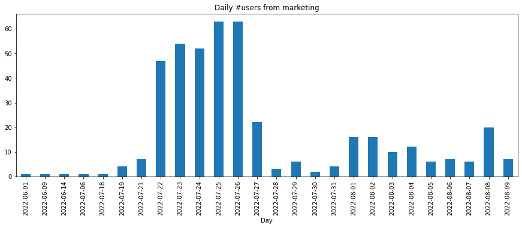
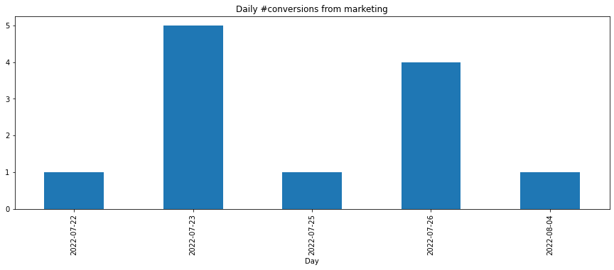
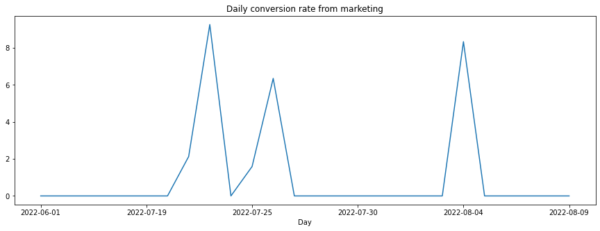
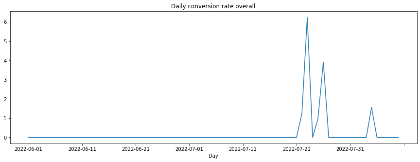
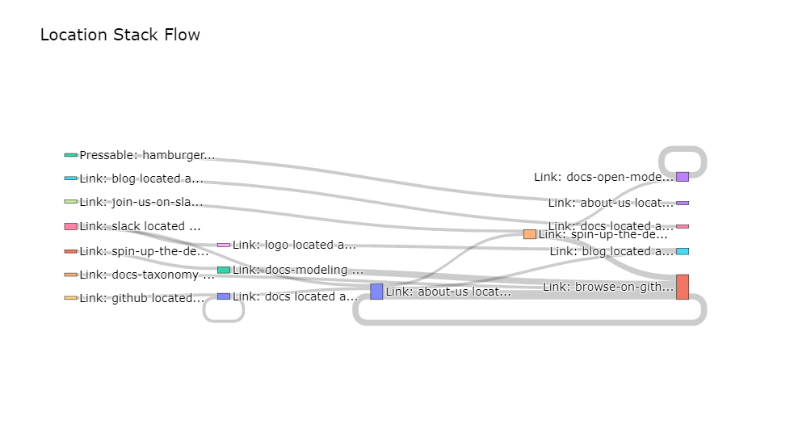
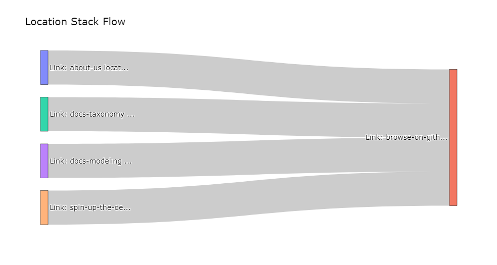

.. _marketing_analytics:

.. frontmatterposition:: 3

.. currentmodule:: bach_open_taxonomy

===================
Marketing analytics
===================

This example notebook shows how you can easily analyze traffic coming from Marketing campaigns, as measured 
via UTM tags. It's also available as a `full Jupyter notebook 
<https://github.com/objectiv/objectiv-analytics/blob/main/notebooks/marketing-analytics.ipynb>`_
to run on your own data (see how to :doc:`get started in your notebook <../get-started-in-your-notebook>`), 
or you can instead `run the Demo </docs/home/try-the-demo/>`_ to quickly try it out. The dataset used 
here is the same as in the Demo.

Get started
-----------
We first have to instantiate the model hub and an Objectiv DataFrame object.

.. doctest::
	:skipif: engine is None

	>>> # set the timeframe of the analysis
	>>> start_date = '2022-06-01'
	>>> end_date = None

.. we override the timeframe for the doctests below
	
.. testsetup:: marketing-analytics
	:skipif: engine is None

	start_date = '2022-06-01'
	end_date = '2022-08-20'
	pd.set_option('display.max_colwidth', 93)

.. doctest:: marketing-analytics
	:skipif: engine is None

	>>> # instantiate the model hub, and set the default time aggregation to daily
	>>> # and set the global contexts that will be used in this example
	>>> from modelhub import ModelHub, display_sql_as_markdown
	>>> from bach import DataFrame
	>>> from datetime import datetime, timedelta
	>>> import pandas as pd
	>>> modelhub = ModelHub(time_aggregation='%Y-%m-%d', global_contexts=['http', 'marketing', 'application'])
	>>> # get an Objectiv DataFrame within a defined timeframe
	>>> df = modelhub.get_objectiv_dataframe(db_url=DB_URL, start_date=start_date, end_date=end_date)

The `location_stack` column, and the columns taken from the global contexts, contain most of the 
event-specific data. These columns are JSON typed, and we can extract data from it using the keys of the JSON 
objects with :doc:`SeriesLocationStack 
<../open-model-hub/api-reference/SeriesLocationStack/modelhub.SeriesLocationStack>` methods, or the `context` 
accessor for global context columns. See the :doc:`open taxonomy example <./open-taxonomy>` for how to use 
the `location_stack` and global contexts.

.. doctest:: marketing-analytics
	:skipif: engine is None

	>>> # add `feature_nice_name` and `root_location` as columns, so that we can use it for grouping etc. later
	>>> df['feature_nice_name'] = df.location_stack.ls.nice_name
	>>> df['root_location'] = df.location_stack.ls.get_from_context_with_type_series(type='RootLocationContext', key='id')

.. doctest:: marketing-analytics
	:skipif: engine is None

	>>> # derive a specific DataFrame with added marketing contexts
	>>> df_acquisition = df.copy()
	>>> # extract referrer and marketing contexts from the respective global contexts
	>>> df_acquisition['referrer'] = df_acquisition.http.context.referrer
	>>> df_acquisition['utm_source'] = df_acquisition.marketing.context.source
	>>> df_acquisition['utm_medium'] = df_acquisition.marketing.context.medium
	>>> df_acquisition['utm_campaign'] = df_acquisition.marketing.context.campaign

.. doctest:: marketing-analytics
	:skipif: engine is None

	>>> # also define a DataFrame with only the sessions that came in via a marketing campaign
	>>> campaign_sessions = df_acquisition[~df_acquisition['utm_source'].isnull()]['session_id'].unique()
	>>> df_marketing_only = df_acquisition[df_acquisition['session_id'].isin(campaign_sessions)]

.. doctest:: marketing-analytics
	:skipif: engine is None

	>>> # define a further selection: which source to select in the below analyses.
	>>> source_selection = ['twitter', 'reddit']
	>>> sources = DataFrame.from_pandas(engine=df.engine, df=pd.DataFrame({'sources': source_selection}), convert_objects=True).sources
	>>> # filter on defined list of UTM Sources
	>>> df_marketing_selection = df_marketing_only[(df_marketing_only.utm_source.isin(sources))]

.. doctest:: marketing-analytics
	:skipif: engine is None

	>>> # materialize the DataFrame as temporary tables to reduce the complexity of the underlying queries
	>>> df_acquisition = df_acquisition.materialize(materialization='temp_table')
	>>> df_marketing_only = df_marketing_only.materialize(materialization='temp_table')
	>>> df_marketing_selection = df_marketing_selection.materialize(materialization='temp_table')

**Available dataframes:**

- `df` = all + `feature_nice_name` + `root_location`.
- `df_acquisition` = `df` + referrer + UTMs
- `df_marketing_only` = `df_acquisition`, but only sessions with non_null `utm_source`.
- `df_marketing_selection` = `df_marketing_only`, but filtered for selection, e.g. only `utm_source` in `{'reddit', 'twitter'}`.

.. admonition:: Reference
	:class: api-reference

	* :doc:`modelhub.ModelHub <../open-model-hub/api-reference/ModelHub/modelhub.ModelHub>`
	* :doc:`modelhub.ModelHub.get_objectiv_dataframe <../open-model-hub/api-reference/ModelHub/modelhub.ModelHub.get_objectiv_dataframe>`
	* :ref:`using global context data <location-stack-and-global-contexts>`
	* :doc:`modelhub.SeriesLocationStack.ls <../open-model-hub/api-reference/SeriesLocationStack/modelhub.SeriesLocationStack.ls>`
	* :doc:`bach.DataFrame.from_pandas <../bach/api-reference/DataFrame/bach.DataFrame.from_pandas>`
	* :doc:`bach.Series.isnull <../bach/api-reference/Series/bach.Series.isnull>`
	* :doc:`bach.DataFrame.materialize <../bach/api-reference/DataFrame/bach.DataFrame.materialize>`

Acquisition
-----------

Users from marketing
~~~~~~~~~~~~~~~~~~~~

.. doctest:: marketing-analytics
	:skipif: engine is None

	>>> users_from_marketing_daily = modelhub.aggregate.unique_users(df_marketing_selection).sort_index(ascending=False)
	>>> users_from_marketing_daily.head()
	time_aggregation
	2022-08-09     7
	2022-08-08    20
	2022-08-07     6
	2022-08-06     7
	2022-08-05     6
	Name: unique_users, dtype: int64

.. doctest:: marketing-analytics
	:skipif: engine is None

	>>> users_from_marketing_daily = modelhub.aggregate.unique_users(df_marketing_selection).sort_index(ascending=False)
	>>> users_from_marketing_daily.sort_index(ascending=True).to_pandas().plot(kind='bar', figsize=[15,5], title='Daily #users from marketing', xlabel='Day', ylabel='#Users')
	<AxesSubplot:title={'center':'Daily #users from marketing'}, xlabel='Day', ylabel='#Users'>

Users per source-medium-campaign over full timeframe
~~~~~~~~~~~~~~~~~~~~~~~~~~~~~~~~~~~~~~~~~~~~~~~~~~~~

.. doctest:: marketing-analytics
	:skipif: engine is None

	>>> # split users by marketing _campaign_ (based on UTM data)
	>>> users_per_campaign = modelhub.aggregate.unique_users(df_marketing_selection, ['utm_source', 'utm_medium', 'utm_campaign'])
	>>> users_per_campaign.reset_index().dropna(axis=0, how='any', subset='utm_source').sort_values(['unique_users'], ascending=False).head(10)
	  utm_source utm_medium         utm_campaign  unique_users
	0    twitter       paid             utm_test           213
	1     reddit       paid                 june            83
	2    twitter       paid      july_conversion            65
	3     reddit       paid      july_conversion            38
	4    twitter     social                 blog            11
	5    twitter       paid                 july             4
	6    twitter      paidl                 july             1
	7    twitter       post  Oktopost-Horizontal             1

.. doctest:: marketing-analytics
	:skipif: engine is None

	>>> # Stacked graph per campaign
	>>> upc = users_per_campaign.to_frame().reset_index()[['utm_source', 'utm_campaign', 'unique_users']]
	>>> upc = upc.to_pandas().groupby(['utm_source', 'utm_campaign'])
	>>> upc_pivot = upc.sum().reset_index().pivot(index='utm_source', columns='utm_campaign')['unique_users'].reset_index().sort_values(by=['utm_source'], ascending=False)
	>>> upc_pivot.plot.bar(x='utm_source', stacked=True)
	<AxesSubplot:xlabel='utm_source'>

.. image:: ../img/docs/example-notebooks/marketing-analytics-users-per-source-campaign.png
  :alt: Users per source-medium-campaign over full timeframe

Users from marketing _source_ per day
~~~~~~~~~~~~~~~~~~~~~~~~~~~~~~~~~~~~~

.. doctest:: marketing-analytics
	:skipif: engine is None

	>>> # users by marketing _source_, per day
	>>> source_users_daily = modelhub.agg.unique_users(df_marketing_selection, groupby=['day', 'utm_source'])
	>>> source_users_daily = source_users_daily.reset_index()
	>>> source_users_daily.sort_values('day', ascending=False).head(20)
	           day utm_source  unique_users
	0   2022-08-09    twitter             3
	1   2022-08-09     reddit             4
	2   2022-08-08     reddit             5
	3   2022-08-08    twitter            15
	4   2022-08-07     reddit             1
	5   2022-08-07    twitter             5
	6   2022-08-06    twitter             4
	7   2022-08-06     reddit             3
	8   2022-08-05    twitter             5
	9   2022-08-05     reddit             1
	10  2022-08-04    twitter            10
	11  2022-08-04     reddit             2
	12  2022-08-03    twitter             4
	13  2022-08-03     reddit             6
	14  2022-08-02     reddit             8
	15  2022-08-02    twitter             8
	16  2022-08-01    twitter            11
	17  2022-08-01     reddit             5
	18  2022-07-31    twitter             1
	19  2022-07-31     reddit             3

Users from marketing _campaign_ per day
~~~~~~~~~~~~~~~~~~~~~~~~~~~~~~~~~~~~~~~

.. doctest:: marketing-analytics
	:skipif: engine is None

	>>> # users by marketing _campaign_ (based on UTM data), per day
	>>> users_per_campaign_daily = modelhub.aggregate.unique_users(df_marketing_selection, ['day', 'utm_source', 'utm_medium', 'utm_campaign'])
	>>> users_per_campaign_daily = users_per_campaign_daily.reset_index()
	>>> users_per_campaign_daily.sort_values('day', ascending=False).head(20)
	           day utm_source utm_medium     utm_campaign  unique_users
	0   2022-08-09     reddit       paid  july_conversion             3
	1   2022-08-09     reddit       paid             june             1
	2   2022-08-09    twitter     social             blog             1
	3   2022-08-09    twitter       paid  july_conversion             2
	4   2022-08-08     reddit       paid  july_conversion             5
	5   2022-08-08    twitter       paid  july_conversion            15
	6   2022-08-07     reddit       paid  july_conversion             1
	7   2022-08-07    twitter       paid  july_conversion             5
	8   2022-08-06     reddit       paid  july_conversion             3
	9   2022-08-06    twitter       paid  july_conversion             4
	10  2022-08-05    twitter       paid  july_conversion             5
	11  2022-08-05     reddit       paid  july_conversion             1
	12  2022-08-04    twitter       paid  july_conversion            10
	13  2022-08-04     reddit       paid  july_conversion             2
	14  2022-08-03    twitter       paid  july_conversion             4
	15  2022-08-03     reddit       paid  july_conversion             6
	16  2022-08-02     reddit       paid  july_conversion             8
	17  2022-08-02    twitter       paid  july_conversion             8
	18  2022-08-01     reddit       paid  july_conversion             4
	19  2022-08-01     reddit       paid             june             1

Referrers overall
~~~~~~~~~~~~~~~~~

.. doctest:: marketing-analytics
	:skipif: engine is None

	>>> # users by referrer in full timeframe (overall, including coming from marketing campaigns)
	>>> referrer_users = modelhub.agg.unique_users(df_acquisition, groupby=['referrer']).sort_values(ascending=False)
	>>> referrer_users.head(20)
	referrer
	                                                           1067
	https://objectiv.io/                                        151
	https://www.google.com/                                     147
	https://www.reddit.com/                                     105
	https://t.co/                                                59
	https://www.linkedin.com/                                    46
	https://github.com/                                          36
	https://github.com/objectiv/objectiv-analytics               34
	https://stackshare.io/                                       17
	https://news.ycombinator.com/                                17
	https://www.kdnuggets.com/                                   16
	https://github.com/RunaCapital/awesome-oss-alternatives      11
	android-app://com.linkedin.android/                          10
	https://objectiv.io/docs/modeling/open-model-hub/             8
	android-app://com.slack/                                      8
	https://www.google.nl/                                        7
	https://objectiv.io/docs/home/quickstart-guide/               7
	https://www.curiosityvc.com/                                  7
	https://www.fly.vc/                                           6
	https://okt.to/                                               6
	Name: unique_users, dtype: int64

.. admonition:: Reference
	:class: api-reference

	* :doc:`bach.Series.sort_index <../bach/api-reference/Series/bach.Series.sort_index>`
	* :doc:`bach.Series.to_pandas <../bach/api-reference/Series/bach.Series.to_pandas>`
	* :doc:`modelhub.Aggregate.unique_users <../open-model-hub/models/aggregation/modelhub.Aggregate.unique_users>`
	* :doc:`bach.Series.reset_index <../bach/api-reference/Series/bach.Series.reset_index>`
	* :doc:`bach.Series.group_by <../bach/api-reference/Series/bach.Series.group_by>`
	* :doc:`bach.DataFrame.dropna <../bach/api-reference/DataFrame/bach.DataFrame.dropna>`
	* :doc:`bach.DataFrame.to_pandas <../bach/api-reference/DataFrame/bach.DataFrame.to_pandas>`
	* :doc:`bach.Series.to_frame <../bach/api-reference/Series/bach.Series.to_frame>`
	* :doc:`bach.DataFrame.head <../bach/api-reference/DataFrame/bach.DataFrame.head>`

Conversion
----------
See conversion overall and from marketing. Conversion in this example is defined as clicking any link on the 
website or docs to our GitHub repo.

.. doctest:: marketing-analytics
	:skipif: engine is None

	>>> # define the conversion event in `df_acquisition` and `df_marketing_selection`
	>>> # in this example: clicking any link leading to our GitHub repo
	>>> # create a column that extracts all location stacks that lead to our GitHub repo
	>>> location_stack_conversion = {'id': 'browse-on-github', '_type': 'LinkContext'}
	>>> modelhub.add_conversion_event(location_stack=df_acquisition.location_stack.json[location_stack_conversion:], event_type='PressEvent', name='github_press')
	>>> modelhub.add_conversion_event(location_stack=df_marketing_selection.location_stack.json[location_stack_conversion:], event_type='PressEvent', name='github_press')
	>>> df_acquisition['is_conversion_event'] = modelhub.map.is_conversion_event(df_acquisition, 'github_press')
	>>> df_marketing_selection['is_conversion_event'] = modelhub.map.is_conversion_event(df_marketing_selection, 'github_press')

.. admonition:: Reference
	:class: api-reference

	* :doc:`bach.series.series_json.JsonAccessor <../bach/api-reference/Series/Json/bach.SeriesJson.json>`
	* :doc:`modelhub.ModelHub.add_conversion_event <../open-model-hub/api-reference/ModelHub/modelhub.ModelHub.add_conversion_event>`
	* :doc:`modelhub.Map.is_conversion_event <../open-model-hub/models/helper-functions/modelhub.Map.is_conversion_event>`	

Daily conversions from marketing
~~~~~~~~~~~~~~~~~~~~~~~~~~~~~~~~

.. doctest:: marketing-analytics
	:skipif: engine is None

	>>> # calculate daily conversions from marketing (based on UTM data)
	>>> conversions_from_marketing = df_marketing_selection[df_marketing_selection.is_conversion_event].dropna(axis=0, how='any', subset='utm_source')
	>>> conversions_from_marketing_daily = modelhub.aggregate.unique_users(conversions_from_marketing).sort_index(ascending=False)
	>>> conversions_from_marketing_daily.head()
	time_aggregation
	2022-08-04    1
	2022-07-26    4
	2022-07-25    1
	2022-07-23    5
	2022-07-22    1
	Name: unique_users, dtype: int64

.. doctest:: marketing-analytics
	:skipif: engine is None

	>>> conversions_from_marketing_daily.sort_index(ascending=True).to_pandas().plot(kind='bar', figsize=[15,5], title='Daily #conversions from marketing', xlabel='Day')
	<AxesSubplot:title={'center':'Daily #conversions from marketing'}, xlabel='Day'>

Daily conversion rate from marketing
~~~~~~~~~~~~~~~~~~~~~~~~~~~~~~~~~~~~

.. doctest:: marketing-analytics
	:skipif: engine is None

	>>> # calculate daily conversion rate from marketing campaigns overall
	>>> # divide conversions from campaigns by total daily number of people coming from campaigns 
	>>> conversion_rate_from_marketing = (conversions_from_marketing_daily / users_from_marketing_daily) * 100
	>>> conversion_rate_from_marketing.sort_index(ascending=False).fillna(0.0).head(10)
	time_aggregation
	2022-08-09    0.000000
	2022-08-08    0.000000
	2022-08-07    0.000000
	2022-08-06    0.000000
	2022-08-05    0.000000
	2022-08-04    8.333333
	2022-08-03    0.000000
	2022-08-02    0.000000
	2022-08-01    0.000000
	2022-07-31    0.000000
	Name: unique_users, dtype: float64

.. doctest:: marketing-analytics
	:skipif: engine is None

	>>> conversion_rate_from_marketing.fillna(0.0).sort_index(ascending=True).to_pandas().plot(kind='line', figsize=[15,5], title='Daily conversion rate from marketing', xlabel='Day')
	<AxesSubplot:title={'center':'Daily conversion rate from marketing'}, xlabel='Day'>

Daily conversions overall
~~~~~~~~~~~~~~~~~~~~~~~~~

.. doctest:: marketing-analytics
	:skipif: engine is None

	>>> # calculate daily conversions overall (including from marketing campaigns)
	>>> conversions_overall = modelhub.aggregate.unique_users(df_acquisition[df_acquisition.is_conversion_event])
	>>> conversions_overall.sort_index(ascending=False).head()
	time_aggregation
	2022-08-04    1
	2022-07-26    4
	2022-07-25    1
	2022-07-23    5
	2022-07-22    1
	Name: unique_users, dtype: int64

	>>> # plot daily conversions overall (including from marketing campaigns)
	>>> conversions_overall.to_pandas().plot(kind='bar', figsize=[15,5], title='Daily #conversions overall', xlabel='Day')
	<AxesSubplot:title={'center':'Daily #conversions overall'}, xlabel='Day'>

Daily conversion rate overall
~~~~~~~~~~~~~~~~~~~~~~~~~~~~~

.. doctest:: marketing-analytics
	:skipif: engine is None

	>>> # calculate daily conversion rate overall (including from marketing campaigns)
	>>> daily_users = modelhub.aggregate.unique_users(df_acquisition).sort_index(ascending=False)
	>>> conversion_rate_overall = (conversions_overall / daily_users) * 100
	>>> conversion_rate_overall.sort_index(ascending=False).head(10)
	time_aggregation
	2022-08-09       NaN
	2022-08-08       NaN
	2022-08-07       NaN
	2022-08-06       NaN
	2022-08-05       NaN
	2022-08-04    1.5625
	2022-08-03       NaN
	2022-08-02       NaN
	2022-08-01       NaN
	2022-07-31       NaN
	Name: unique_users, dtype: float64

	>>> conversion_rate_overall.sort_index(ascending=True).fillna(0.0).to_pandas().plot(kind='line', figsize=[15,5], title='Daily conversion rate overall', xlabel='Day')
	<AxesSubplot:title={'center':'Daily conversion rate overall'}, xlabel='Day'>

.. admonition:: Reference
	:class: api-reference

	* :doc:`modelhub.Map.is_conversion_event <../open-model-hub/models/helper-functions/modelhub.Map.is_conversion_event>`
	* :doc:`bach.DataFrame.dropna <../bach/api-reference/DataFrame/bach.DataFrame.dropna>`
	* :doc:`modelhub.Aggregate.unique_users <../open-model-hub/models/aggregation/modelhub.Aggregate.unique_users>`
	* :doc:`bach.Series.sort_index <../bach/api-reference/Series/bach.Series.sort_index>`
	* :doc:`bach.DataFrame.to_pandas <../bach/api-reference/DataFrame/bach.DataFrame.to_pandas>`
	* :doc:`bach.DataFrame.fillna <../bach/api-reference/DataFrame/bach.DataFrame.fillna>`
	* :doc:`bach.DataFrame.head <../bach/api-reference/DataFrame/bach.DataFrame.head>`

Conversion split by source & campaign
~~~~~~~~~~~~~~~~~~~~~~~~~~~~~~~~~~~~~

Conversions per marketing _source_ over full timeframe
^^^^^^^^^^^^^^^^^^^^^^^^^^^^^^^^^^^^^^^^^^^^^^^^^^^^^^

.. doctest:: marketing-analytics
	:skipif: engine is None
	
	>>> # calculate conversions per marketing _source_ over the full timeframe (based on UTM data)
	>>> campaign_conversions_source_timeframe = modelhub.aggregate.unique_users(df_marketing_selection[df_marketing_selection.is_conversion_event], ['utm_source'])
	>>> campaign_conversions_source_timeframe.reset_index().dropna(axis=0, how='any', subset='utm_source').sort_values(['unique_users'], ascending=False).head()
	  utm_source  unique_users
	0    twitter             8
	1     reddit             3

Conversions per marketing _source_ daily
^^^^^^^^^^^^^^^^^^^^^^^^^^^^^^^^^^^^^^^^

.. doctest:: marketing-analytics
	:skipif: engine is None
	
	>>> # split daily conversions by marketing _source_ (based on UTM data)
	>>> campaign_conversions_source_daily = modelhub.aggregate.unique_users(df_marketing_selection[df_marketing_selection.is_conversion_event], ['day', 'utm_source'])
	>>> campaign_conversions_source_daily.reset_index().dropna(axis=0, how='any', subset='utm_source').set_index('day').sort_index(ascending=False).head(10)
	           utm_source  unique_users
	day
	2022-08-04    twitter             1
	2022-07-26     reddit             1
	2022-07-26    twitter             3
	2022-07-25    twitter             1
	2022-07-23    twitter             3
	2022-07-23     reddit             2
	2022-07-22    twitter             1

Conversions per marketing _campaign_ over full timeframe
^^^^^^^^^^^^^^^^^^^^^^^^^^^^^^^^^^^^^^^^^^^^^^^^^^^^^^^^

.. doctest:: marketing-analytics
	:skipif: engine is None
	
	>>> # split conversions by marketing _campaign_ (based on UTM data)
	>>> campaign_conversions_campaign = modelhub.aggregate.unique_users(df_marketing_selection[df_marketing_selection.is_conversion_event], ['utm_source', 'utm_medium', 'utm_campaign'])
	>>> campaign_conversions_campaign.reset_index().dropna(axis=0, how='any', subset='utm_source').sort_values(['utm_source', 'unique_users'], ascending=False).head()
	  utm_source utm_medium     utm_campaign  unique_users
	0    twitter       paid         utm_test             8
	1    twitter       paid  july_conversion             1
	2     reddit       paid             june             3

.. admonition:: Reference
	:class: api-reference

	* :doc:`modelhub.Aggregate.unique_users <../open-model-hub/models/aggregation/modelhub.Aggregate.unique_users>`
	* :doc:`modelhub.Map.is_conversion_event <../open-model-hub/models/helper-functions/modelhub.Map.is_conversion_event>`
	* :doc:`bach.DataFrame.dropna <../bach/api-reference/DataFrame/bach.DataFrame.dropna>`
	* :doc:`bach.DataFrame.sort_values <../bach/api-reference/DataFrame/bach.DataFrame.sort_values>`
	* :doc:`bach.Series.sort_index <../bach/api-reference/Series/bach.Series.sort_index>`
	* :doc:`bach.DataFrame.head <../bach/api-reference/DataFrame/bach.DataFrame.head>`

Avg. Duration
-------------

Avg. duration per ad source
~~~~~~~~~~~~~~~~~~~~~~~~~~~

.. doctest:: marketing-analytics
	:skipif: engine is None
	
	>>> # avg duration for users that come from an ad campaign in the full timeframe
	>>> duration_per_source = modelhub.aggregate.session_duration(df_marketing_selection, groupby=['utm_source']).to_frame()
	>>> duration_per_source.sort_values(['utm_source'], ascending=False).head(10)
	                 session_duration
	utm_source
	twitter    0 days 00:02:21.409402
	reddit     0 days 00:02:05.284562

Vs. avg. duration by all users
~~~~~~~~~~~~~~~~~~~~~~~~~~~~~~

.. doctest:: marketing-analytics
	:skipif: engine is None
	
	>>> # vs time spent by all users
	>>> modelhub.aggregate.session_duration(df_acquisition, groupby=None).to_frame().head()
	        session_duration
	0 0 days 00:03:37.740488

Avg. duration for converted users per _source_
~~~~~~~~~~~~~~~~~~~~~~~~~~~~~~~~~~~~~~~~~~~~~~

.. doctest:: marketing-analytics
	:skipif: engine is None
	
	>>> # avg. duration for converted users - per source
	>>> # label sessions with a conversion
	>>> df_marketing_selection['converted_users'] = modelhub.map.conversions_counter(df_marketing_selection, name='github_press') >= 1
	>>> # label hits where at that point in time, there are 0 conversions in the session
	>>> df_marketing_selection['zero_conversions_at_moment'] = modelhub.map.conversions_in_time(df_marketing_selection, 'github_press') == 0
	>>> # filter on above created labels to find the users who converted for the very first time
	>>> converted_users = df_marketing_selection[(df_marketing_selection.converted_users & df_marketing_selection.zero_conversions_at_moment)]
	>>> modelhub.aggregate.session_duration(converted_users, groupby=['utm_source']).to_frame().sort_values('utm_source', ascending=False).head(20)
	                 session_duration
	utm_source
	twitter    0 days 00:00:23.775200
	reddit     0 days 00:02:02.262000

Avg. duration per converted user
~~~~~~~~~~~~~~~~~~~~~~~~~~~~~~~~

.. doctest:: marketing-analytics
	:skipif: engine is None

	>>> # duration before conversion - per source & user
	>>> # label sessions with a conversion
	>>> df_marketing_selection['converted_users'] = modelhub.map.conversions_counter(df_marketing_selection, name='github_press', partition='user_id') >= 1
	>>> # label hits where at that point in time, there are 0 conversions in the session
	>>> df_marketing_selection['zero_conversions_at_moment'] = modelhub.map.conversions_in_time(df_marketing_selection, 'github_press', partition='user_id') == 0
	>>> # materialize the data frame after adding columns as temporary table to reduce the complexity of the underlying queries
	>>> df_marketing_selection = df_marketing_selection.materialize(materialization='temp_table')
	>>> # filter on above created labels to find the users who converted for the very first time
	>>> converted_users = df_marketing_selection[(df_marketing_selection.converted_users & df_marketing_selection.zero_conversions_at_moment)]
	>>> modelhub.aggregate.session_duration(converted_users, groupby=['day', 'utm_source', 'user_id']).to_frame().sort_values('day', ascending=False).head(20)
	                                                                 session_duration
	day        utm_source user_id
	2022-07-26 reddit     ed42dc5f-6040-4ddc-b7e5-48162adb7bbc 0 days 00:02:02.262000
	           twitter    99f741a0-d05e-4688-8bd9-53f66bf926aa 0 days 00:00:41.883000
	                      b2e983c9-11c2-4a98-bc15-b96cd93e0a23 0 days 00:00:00.014000
	2022-07-23 twitter    0586a3c6-3316-4e11-99d6-617942d28e28 0 days 00:00:00.352000
	2022-07-22 twitter    a4883c3d-8aa1-4222-b6ad-e765c6900179 0 days 00:01:02.267000

Avg. duration before first conversion
~~~~~~~~~~~~~~~~~~~~~~~~~~~~~~~~~~~~~
Avg. duration for users that converted for the very first time (not including hits or sessions after the 
moment of conversion).

.. doctest:: marketing-analytics
	:skipif: engine is None

	>>> # avg duration before conversion - overall
	>>> modelhub.aggregate.session_duration(converted_users, groupby=None).to_frame().head()
	        session_duration
	0 0 days 00:00:45.355600

Avg. duration before first conversion per _source_
~~~~~~~~~~~~~~~~~~~~~~~~~~~~~~~~~~~~~~~~~~~~~~~~~~
Avg. duration per campaign _source_ for users who converted for the very first time (not including hits or 
sessions after the moment of conversion).

.. doctest:: marketing-analytics
	:skipif: engine is None

	>>> # avg duration before conversion - per source
	>>> modelhub.aggregate.session_duration(converted_users, groupby=['utm_source']).to_frame().head()
	                 session_duration
	utm_source
	reddit     0 days 00:02:02.262000
	twitter    0 days 00:00:26.129000

Avg. duration with bounces filtered out
~~~~~~~~~~~~~~~~~~~~~~~~~~~~~~~~~~~~~~~

.. doctest:: marketing-analytics
	:skipif: engine is None

	>>> # create dataframe for sessions without zero duration (aka bounces)
	>>> df_marketing_no_bounces = modelhub.aggregate.session_duration(df_marketing_selection, groupby=['utm_source', 'session_id'], exclude_bounces=True).to_frame()
	>>> # avg duration for non-bounced users that come from an ad campaign in the full timeframe
	>>> df_marketing_no_bounces = df_marketing_no_bounces.reset_index().groupby(['utm_source'])['session_duration'].mean().to_frame()
	>>> df_marketing_no_bounces.head(30)
	                 session_duration
	utm_source
	reddit     0 days 00:02:05.284562
	twitter    0 days 00:02:21.409402

Avg. daily duration per campaign _source_
~~~~~~~~~~~~~~~~~~~~~~~~~~~~~~~~~~~~~~~~~

.. doctest:: marketing-analytics
	:skipif: engine is None

	>>> # calculate time spent per campaign source, daily
	>>> duration_per_source_daily = modelhub.agg.session_duration(df_marketing_selection, groupby=['utm_source', 'day']).to_frame()
	>>> # calculate the number of users per campaign source, daily
	>>> source_users_daily = modelhub.agg.unique_users(df_acquisition, groupby=['utm_source', 'day'])
	>>> source_users_daily = source_users_daily.reset_index()
	>>> # add them together
	>>> source_duration_users_daily = duration_per_source_daily.merge(source_users_daily, how='left', on=['utm_source', 'day']);
	>>> # also add #conversions
	>>> converted_users = campaign_conversions_source_daily.to_frame().rename(columns={"unique_users": "converted_users"})
	>>> source_duration_users_daily = source_duration_users_daily.merge(converted_users, how='left', on=['utm_source', 'day'])
	>>> source_duration_users_daily = source_duration_users_daily.sort_values(['utm_source', 'day'], ascending=False)
	>>> source_duration_users_daily.head(50)
	                            session_duration  unique_users  converted_users
	utm_source day
	twitter    2022-08-08 0 days 00:03:13.881900            15              NaN
	           2022-08-07 0 days 00:00:16.193333             5              NaN
	           2022-08-05 0 days 00:00:01.339500             5              NaN
	           2022-08-04 0 days 00:01:03.227500            10              1.0
	           2022-08-03 0 days 00:05:55.457000             4              NaN
	           2022-08-02 0 days 00:00:09.290600             8              NaN
	           2022-08-01 0 days 00:00:39.053833            11              NaN
	           2022-07-31 0 days 00:01:10.712000             1              NaN
	           2022-07-29 0 days 00:13:07.583500             6              NaN
	           2022-07-28 0 days 00:00:32.512667             3              NaN
	           2022-07-27 0 days 00:01:12.981000            18              NaN
	           2022-07-26 0 days 00:01:24.773308            48              3.0
	           2022-07-25 0 days 00:02:52.283667            44              1.0
	           2022-07-24 0 days 00:03:46.970400            34              NaN
	           2022-07-23 0 days 00:02:27.544364            44              3.0
	           2022-07-22 0 days 00:06:42.148000            35              1.0
	           2022-07-21 0 days 00:02:14.805500             6              NaN
	           2022-07-06 0 days 00:00:01.071000             1              NaN
	           2022-06-09 0 days 00:03:44.867333             1              NaN
	reddit     2022-08-09 0 days 00:01:02.719333             4              NaN
	           2022-08-08 0 days 00:01:14.918500             5              NaN
	           2022-08-04 0 days 00:00:06.454000             2              NaN
	           2022-08-03 0 days 00:00:28.143000             6              NaN
	           2022-08-02 0 days 00:00:06.503000             8              NaN
	           2022-08-01 0 days 00:00:01.911000             5              NaN
	           2022-07-26 0 days 00:02:12.743000            15              1.0
	           2022-07-25 0 days 00:00:04.305000            19              NaN
	           2022-07-24 0 days 00:06:12.431143            18              NaN
	           2022-07-23 0 days 00:00:25.027167            10              2.0
	           2022-07-22 0 days 00:00:25.080000            12              NaN
	           2022-07-19 0 days 00:08:17.317000             4              NaN

.. admonition:: Reference
	:class: api-reference

	* :doc:`modelhub.Aggregate.session_duration <../open-model-hub/models/aggregation/modelhub.Aggregate.session_duration>`
	* :doc:`bach.DataFrame.sort_values <../bach/api-reference/DataFrame/bach.DataFrame.sort_values>`
	* :doc:`modelhub.Map.conversions_counter <../open-model-hub/models/helper-functions/modelhub.Map.conversions_counter>`
	* :doc:`modelhub.Map.conversions_in_time <../open-model-hub/models/helper-functions/modelhub.Map.conversions_in_time>`
	* :doc:`bach.Series.to_frame <../bach/api-reference/Series/bach.Series.to_frame>`
	* :doc:`bach.Series.reset_index <../bach/api-reference/Series/bach.Series.reset_index>`
	* :doc:`modelhub.Aggregate.unique_users <../open-model-hub/models/aggregation/modelhub.Aggregate.unique_users>`
	* :doc:`bach.DataFrame.dropna <../bach/api-reference/DataFrame/bach.DataFrame.dropna>`
	* :doc:`bach.DataFrame.merge <../bach/api-reference/DataFrame/bach.DataFrame.merge>`
	* :doc:`bach.DataFrame.head <../bach/api-reference/DataFrame/bach.DataFrame.head>`

Deep-dive into user behavior from marketing
-------------------------------------------

Top used product features for users from marketing campaigns
~~~~~~~~~~~~~~~~~~~~~~~~~~~~~~~~~~~~~~~~~~~~~~~~~~~~~~~~~~~~

.. doctest:: marketing-analytics
	:skipif: engine is None

	>>> # top used product features for users coming from marketing campaigns
	>>> top_product_features_from_marketing = modelhub.aggregate.top_product_features(df_marketing_selection)
	>>> top_product_features_from_marketing.head(20)
	                                                                                user_id_nunique
	application      feature_nice_name                                  event_type
	objectiv-website Link: about-us located at Root Location: home =... PressEvent               21
	                 Link: spin-up-the-demo located at Root Location... PressEvent               20
	                 Link: browse-on-github located at Root Location... PressEvent               11
	                 Link: docs located at Root Location: home => Na... PressEvent               11
	                 Link: logo located at Root Location: home => Na... PressEvent                8
	                 Link: spin-up-the-demo located at Root Location... PressEvent                6
	                 Link: logo located at Root Location: blog => Na... PressEvent                6
	                 Link: blog located at Root Location: home => Na... PressEvent                6
	                 Link: docs-taxonomy located at Root Location: h... PressEvent                5
	                 Link: faq located at Root Location: home => Nav... PressEvent                3
	                 Link: docs-modeling located at Root Location: h... PressEvent                2
	                 Link: docs-open-model-hub located at Root Locat... PressEvent                2
	                 Link: slack located at Root Location: home => N... PressEvent                2
	                 Link: jobs located at Root Location: home => Na... PressEvent                2
	                 Pressable: hamburger located at Root Location: ... PressEvent                1
	                 Link: about-us located at Root Location: home =... PressEvent                1
	                 Link: blog located at Root Location: blog => Na... PressEvent                1
	                 Link: docs located at Root Location: blog => Na... PressEvent                1
	                 Link: docs-tracking located at Root Location: h... PressEvent                1
	                 Link: github located at Root Location: home => ... PressEvent                1

Top used product features for users from marketing campaigns, before they convert
^^^^^^^^^^^^^^^^^^^^^^^^^^^^^^^^^^^^^^^^^^^^^^^^^^^^^^^^^^^^^^^^^^^^^^^^^^^^^^^^^

.. doctest:: marketing-analytics
	:skipif: engine is None

	>>> # top used product features for users coming from marketing campaigns, before they convert
	>>> top_features_before_conversion_from_marketing = modelhub.agg.top_product_features_before_conversion(df_marketing_selection, name='github_press')
	>>> top_features_before_conversion_from_marketing.head(20)
	                                                                                                      unique_users
	application      feature_nice_name                                                        event_type
	objectiv-website Link: about-us located at Root Location: home => Navigation: navbar-top  PressEvent             2
	                 Link: docs-modeling located at Root Location: home => Content: solution  PressEvent             1
	                 Link: docs-taxonomy located at Root Location: home => Content: taxonomy  PressEvent             1
	                 Link: spin-up-the-demo located at Root Location: home => Content: hero   PressEvent             1
	                 Link: spin-up-the-demo located at Root Location: home => Content: try-it PressEvent             1

.. doctest:: marketing-analytics
	:skipif: engine is None

	>>> # calculate the percentage of converted users per feature: (converted users per feature) / (total users converted)
	>>> total_converted_users = df_marketing_selection[df_marketing_selection['is_conversion_event']]['user_id'].unique().count().value
	>>> top_conversion_locations = modelhub.agg.unique_users(df_marketing_selection[df_marketing_selection['is_conversion_event']], groupby='feature_nice_name')
	>>> top_conversion_locations = (top_conversion_locations / total_converted_users) * 100
	>>> # show the results, with .to_frame() for nicer formatting
	>>> top_conversion_locations = top_conversion_locations.to_frame().rename(columns={'unique_users': 'converted_users_percentage'})
	>>> top_conversion_locations.sort_values(by='converted_users_percentage', ascending=False).head()
	                                                                         converted_users_percentage
	feature_nice_name
	Link: browse-on-github located at Root Location: home => Content: hero                       100.0

.. admonition:: Reference
	:class: api-reference

	* :doc:`modelhub.Aggregate.top_product_features <../open-model-hub/models/aggregation/modelhub.Aggregate.top_product_features>`
	* :doc:`modelhub.Aggregate.top_product_features_before_conversion <../open-model-hub/models/aggregation/modelhub.Aggregate.top_product_features_before_conversion>`
	* :doc:`bach.Series.unique <../bach/api-reference/Series/bach.Series.unique>`
	* :doc:`bach.Series.count <../bach/api-reference/Series/bach.Series.count>`
	* :doc:`bach.Series.to_frame <../bach/api-reference/Series/bach.Series.to_frame>`
	* :doc:`bach.DataFrame.head <../bach/api-reference/DataFrame/bach.DataFrame.head>`

Funnel Discovery: flows for _all_ users from marketing campaigns
~~~~~~~~~~~~~~~~~~~~~~~~~~~~~~~~~~~~~~~~~~~~~~~~~~~~~~~~~~~~~~~~

.. doctest:: marketing-analytics
	:skipif: engine is None

	>>> # select which event type to use for further analysis - PressEvents to focus on what users directly interact with
	>>> df_funnel_from_marketing = df_marketing_selection[df_marketing_selection['event_type'] == 'PressEvent']
	>>> # instantiate the FunnelDiscovery model from the open model hub
	>>> funnel = modelhub.get_funnel_discovery()
	>>> # set the maximum n steps
	>>> max_steps = 4

.. doctest:: marketing-analytics
	:skipif: engine is None

	>>> # for every user starting their session, find all maximum n consecutive steps they took
	>>> df_steps = funnel.get_navigation_paths(df_funnel_from_marketing, steps=max_steps, by='user_id')
	>>> df_steps.head()
	                                                                                        location_stack_step_1 location_stack_step_2 location_stack_step_3 location_stack_step_4
	user_id
	00d9abb7-8f5b-40ef-b189-4b046450eb3d      Link: logo located at Root Location: home => Navigation: navbar-top                  None                  None                  None
	04ac1790-825a-47a3-aac3-dccfeee61ade      Link: logo located at Root Location: blog => Navigation: navbar-top                  None                  None                  None
	0586a3c6-3316-4e11-99d6-617942d28e28   Link: browse-on-github located at Root Location: home => Content: hero                  None                  None                  None
	099dd8fd-696f-425a-a358-86da9c92a703  Link: about-us located at Root Location: home => Navigation: navbar-top                  None                  None                  None
	0a544db0-158c-41f2-b8c5-c951b87fd093      Link: logo located at Root Location: home => Navigation: navbar-top                  None                  None                  None

.. doctest:: marketing-analytics
	:skipif: engine is None

	>>> # calculate the most frequent consecutive steps that all users took after starting their session, based on the location stack
	>>> df_steps.value_counts().to_frame().head(20)
	                                                                                                                                                                                                                                                                                                  value_counts
	location_stack_step_1                                                     location_stack_step_2                                                   location_stack_step_3                                                   location_stack_step_4          
	Link: spin-up-the-demo located at Root Location: home => Content: hero    NaN                                                                     NaN                                                                     NaN                                                                               17
	Link: about-us located at Root Location: home => Navigation: navbar-top   NaN                                                                     NaN                                                                     NaN                                                                               16
	Link: browse-on-github located at Root Location: home => Content: hero    NaN                                                                     NaN                                                                     NaN                                                                                8
	Link: docs located at Root Location: home => Navigation: navbar-top       NaN                                                                     NaN                                                                     NaN                                                                                8
	Link: logo located at Root Location: home => Navigation: navbar-top       NaN                                                                     NaN                                                                     NaN                                                                                6
	Link: logo located at Root Location: blog => Navigation: navbar-top       NaN                                                                     NaN                                                                     NaN                                                                                6
	Link: spin-up-the-demo located at Root Location: home => Content: try-it  NaN                                                                     NaN                                                                     NaN                                                                                5
	Link: blog located at Root Location: home => Navigation: navbar-top       NaN                                                                     NaN                                                                     NaN                                                                                4
	Link: docs-taxonomy located at Root Location: home => Content: taxonomy   NaN                                                                     NaN                                                                     NaN                                                                                4
	Link: faq located at Root Location: home => Navigation: navbar-top        NaN                                                                     NaN                                                                     NaN                                                                                3
	Link: jobs located at Root Location: home => Navigation: navbar-top       NaN                                                                     NaN                                                                     NaN                                                                                2
	Link: docs-taxonomy located at Root Location: home => Content: taxonomy   Link: browse-on-github located at Root Location: home => Content: hero  Link: about-us located at Root Location: home => Navigation: navbar-top Link: browse-on-github located at Root Location: home => Content: hero             1
	Link: docs-tracking located at Root Location: home => Content: solution   NaN                                                                     NaN                                                                     NaN                                                                                1
	Link: github located at Root Location: home => Navigation: navbar-top     Link: docs located at Root Location: home => Navigation: navbar-top     NaN                                                                     NaN                                                                                1
	Link: join-us-on-slack located at Root Location: home => Content: slack   Link: spin-up-the-demo located at Root Location: home => Content: hero  NaN                                                                     NaN                                                                                1
	Link: logo located at Root Location: home => Navigation: navbar-top       Link: blog located at Root Location: home => Navigation: navbar-top     NaN                                                                     NaN                                                                                1
	Link: privacy-policy located at Root Location: home => Navigation: footer NaN                                                                     NaN                                                                     NaN                                                                                1
	Link: slack located at Root Location: home => Navigation: navbar-top      Link: about-us located at Root Location: home => Navigation: navbar-top NaN                                                                     NaN                                                                                1
	                                                                          Link: logo located at Root Location: home => Navigation: navbar-top     NaN                                                                     NaN                                                                                1
	Link: spin-up-the-demo located at Root Location: home => Content: hero    Link: browse-on-github located at Root Location: home => Content: hero  NaN                                                                     NaN                                                                                1

.. code-block:: jupyter-notebook
	
	>>> funnel.plot_sankey_diagram(df_steps, n_top_examples=50)

Funnel Discovery: flows for _converted_ users from marketing
~~~~~~~~~~~~~~~~~~~~~~~~~~~~~~~~~~~~~~~~~~~~~~~~~~~~~~~~~~~~

.. doctest:: marketing-analytics
	:skipif: engine is None

	>>> # add which step resulted in conversion to the dataframe, with the `add_conversion_step_column` param
	>>> # filter down to all sequences that have actually converted with the `only_converted_paths` param
	>>> df_steps_till_conversion = funnel.get_navigation_paths(df_funnel_from_marketing, steps=max_steps, by='user_id', add_conversion_step_column=True, only_converted_paths=True)
	>>> df_steps_till_conversion.head(5)
	                                                                                        location_stack_step_1                                                   location_stack_step_2                                                   location_stack_step_3 location_stack_step_4  _first_conversion_step_number
	user_id
	99f741a0-d05e-4688-8bd9-53f66bf926aa  Link: about-us located at Root Location: home => Navigation: navbar-top  Link: browse-on-github located at Root Location: home => Content: hero                                                                    None                  None                              2
	99f741a0-d05e-4688-8bd9-53f66bf926aa  Link: docs-taxonomy located at Root Location: home => Content: taxonomy  Link: browse-on-github located at Root Location: home => Content: hero                                                                    None                  None                              2
	a4883c3d-8aa1-4222-b6ad-e765c6900179   Link: spin-up-the-demo located at Root Location: home => Content: hero  Link: browse-on-github located at Root Location: home => Content: hero                                                                    None                  None                              2
	a4883c3d-8aa1-4222-b6ad-e765c6900179  Link: about-us located at Root Location: home => Navigation: navbar-top  Link: spin-up-the-demo located at Root Location: home => Content: hero  Link: browse-on-github located at Root Location: home => Content: hero                  None                              3
	ed42dc5f-6040-4ddc-b7e5-48162adb7bbc  Link: docs-modeling located at Root Location: home => Content: solution  Link: browse-on-github located at Root Location: home => Content: hero                                                                    None                  None                              2

.. code-block:: jupyter-notebook
	
	>>> # plot the Sankey diagram using the top examples via the `n_top_examples` param
	>>> condition_convert_on_step = df_steps_till_conversion['_first_conversion_step_number'] == 2
	>>> funnel.plot_sankey_diagram(df_steps_till_conversion[condition_convert_on_step], n_top_examples=15)

Funnel Discovery: drop-off for users from marketing
~~~~~~~~~~~~~~~~~~~~~~~~~~~~~~~~~~~~~~~~~~~~~~~~~~~

.. doctest:: marketing-analytics
	:skipif: engine is None

	>>> # select only non-converted users
	>>> df_funnel_non_converted = df_marketing_selection[~df_marketing_selection['is_conversion_event']]
	>>> funnel_converted_users = df_marketing_selection[df_marketing_selection['is_conversion_event']]['user_id']
	>>> # select the events of these non converted users
	>>> df_funnel_non_converted = df_funnel_non_converted[~df_funnel_non_converted['user_id'].isin(funnel_converted_users)]
	>>> # get the last used feature in the location_stack before dropping off
	>>> drop_loc = df_funnel_non_converted.sort_values('moment').groupby('user_id')['feature_nice_name'].to_json_array().json[-1].materialize()
	>>> total_count = drop_loc.count().value
	>>> # show the last used features by non-converted users, sorted by their usage share compared to all features
	>>> drop_loc_percent = (drop_loc.value_counts() / total_count) * 100
	>>> drop_loc_percent = drop_loc_percent.to_frame().rename(columns={'value_counts': 'drop_percentage'})
	>>> drop_loc_percent.sort_values(by='drop_percentage', ascending=False).head(10)
	                                                                                               drop_percentage
	feature_nice_name
	Root Location: home                                                                                  90.796020
	Overlay: star-us-notification-overlay located at Root Location: home => Pressable: star-us...         3.980100
	Root Location: blog                                                                                   1.741294
	Link: logo located at Root Location: blog => Navigation: navbar-top                                   0.995025
	Link: about-us located at Root Location: home => Navigation: navbar-top                               0.746269
	Link: logo located at Root Location: home => Navigation: navbar-top                                   0.497512
	Link: slack located at Root Location: home => Navigation: navbar-top                                  0.248756
	Link: jobs located at Root Location: home => Navigation: navbar-top                                   0.248756
	Link: faq located at Root Location: home => Navigation: navbar-top                                    0.248756
	Link: spin-up-the-demo located at Root Location: home => Content: hero                                0.248756

.. admonition:: Reference
	:class: api-reference

	* :doc:`modelhub.ModelHub.get_funnel_discovery <../open-model-hub/api-reference/ModelHub/modelhub.ModelHub.get_funnel_discovery>`
	* :doc:`modelhub.FunnelDiscovery.get_navigation_paths <../open-model-hub/models/funnels/FunnelDiscovery/modelhub.FunnelDiscovery.get_navigation_paths>`
	* :doc:`bach.Series.to_frame <../bach/api-reference/Series/bach.Series.to_frame>`
	* :doc:`bach.DataFrame.head <../bach/api-reference/DataFrame/bach.DataFrame.head>`
	* :doc:`modelhub.FunnelDiscovery.plot_sankey_diagram <../open-model-hub/models/funnels/FunnelDiscovery/modelhub.FunnelDiscovery.plot_sankey_diagram>`
	* :doc:`bach.DataFrame.rename <../bach/api-reference/DataFrame/bach.DataFrame.rename>`
	* :doc:`bach.DataFrame.sort_values <../bach/api-reference/DataFrame/bach.DataFrame.sort_values>`

Predict User Behavior from campaigns
------------------------------------

You can run predictive modeling on your marketing data as well. For example, you can create a feature for the 
number of times a user came in through a specific marketing source.

The created marketing feature set can be merged with any user-level feature set for logistic regression, like 
`features_set_sample` from the :doc:`logistic regression example notebook <./logistic-regression>`. 
For more details on how to do feature engineering, see our 
:doc:`feature engineering example notebook <./feature-engineering>`.

.. doctest:: marketing-analytics
	:skipif: engine is None

	>>> # create a feature for the number of times a user came in through a specific marketing source:
	>>> feature_prepare = df_acquisition.copy()
	>>> feature_prepare['utm_source'] = feature_prepare.utm_source.fillna('none')
	>>> features_us = feature_prepare.groupby(['user_id', 'utm_source']).session_id.nunique()
	>>> features_us_unstacked = features_us.unstack(fill_value=0)
	>>> features_us_unstacked.head()
	                                      test  reddit  linkedin  twitter  none  hs_email  reactdigest
	user_id
	0000bb2f-66e9-4e48-8e2f-7d0a82446ef4     0       0         0        0     1         0            0
	000c5fff-ceb0-4533-b182-b285494fd822     0       0         0        0     1         0            0
	002116e6-baf2-4f10-bcda-85166008c9b3     0       0         0        0     2         0            0
	0030b2d8-4be4-4cba-bb59-f1c6e89dae4f     0       0         0        0     3         0            0
	003fea99-74aa-4c71-8f9c-b81d8d882422     0       0         0        0     1         0            0

.. admonition:: Reference
	:class: api-reference

	* :doc:`bach.DataFrame.copy <../bach/api-reference/DataFrame/bach.DataFrame.copy>`
	* :doc:`bach.DataFrame.fillna <../bach/api-reference/DataFrame/bach.DataFrame.fillna>`
	* :doc:`bach.DataFrame.groupby <../bach/api-reference/DataFrame/bach.DataFrame.groupby>`
	* :doc:`bach.DataFrame.nunique <../bach/api-reference/DataFrame/bach.DataFrame.nunique>`
	* :doc:`bach.Series.unstack <../bach/api-reference/Series/bach.Series.unstack>`
	* :doc:`bach.DataFrame.head <../bach/api-reference/DataFrame/bach.DataFrame.head>`

Get the SQL for any analysis
----------------------------

The SQL for any analysis can be exported with one command, so you can use models in production directly to 
simplify data debugging & delivery to BI tools like Metabase, dbt, etc. See how you can `quickly create BI 
dashboards with this <https://objectiv.io/docs/home/try-the-demo#creating-bi-dashboards>`_.
