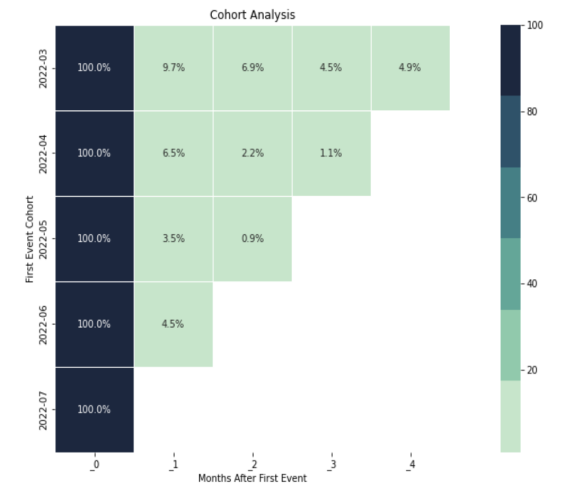

.. _example_product_analytics:

.. frontmatterposition:: 2

.. currentmodule:: bach_open_taxonomy

=================
Product analytics
=================

This example notebook shows how you can easily analyze the basics of product analytics. It's also available 
as a `full Jupyter notebook 
<https://github.com/objectiv/objectiv-analytics/blob/main/notebooks/basic-product-analytics.ipynb>`_
to run on your own data (see how to :doc:`get started in your notebook <../get-started-in-your-notebook>`), 
or you can instead `run the Demo </docs/home/try-the-demo/>`_ to quickly try it out. The dataset used 
here is the same as in the Demo.

Get started
-----------
We first have to instantiate the model hub and an Objectiv DataFrame object.

.. doctest::
	:skipif: engine is None

	>>> # set the timeframe of the analysis
	>>> start_date = '2022-03-01'
	>>> end_date = None

.. we override the timeframe for the doctests below
	
.. testsetup:: product-analytics
	:skipif: engine is None

	start_date = '2022-03-01'
	end_date = '2022-07-30'
	pd.set_option('display.max_colwidth', 93)

.. doctest:: product-analytics
	:skipif: engine is None

	>>> from modelhub import ModelHub, display_sql_as_markdown
	>>> from datetime import datetime
	>>> # instantiate the model hub and set the default time aggregation to daily
	>>> # and set the global contexts that will be used in this example
	>>> modelhub = ModelHub(time_aggregation='%Y-%m-%d', global_contexts=['application'])
	>>> # get a Bach DataFrame with Objectiv data within a defined timeframe
	>>> df = modelhub.get_objectiv_dataframe(start_date=start_date, end_date=end_date)

The `location_stack` column, and the columns taken from the global contexts, contain most of the 
event-specific data. These columns are JSON typed, and we can extract data from it using the keys of the JSON 
objects with :doc:`SeriesLocationStack 
<../open-model-hub/api-reference/SeriesLocationStack/modelhub.SeriesLocationStack>` methods, or the `context` 
accessor for global context columns. See the :doc:`open taxonomy example <./open-taxonomy>` for how to use 
the `location_stack` and global contexts.

.. doctest:: product-analytics
	:skipif: engine is None

	>>> df['application_id'] = df.application.context.id
	>>> df['feature_nice_name'] = df.location_stack.ls.nice_name
	>>> df['root_location'] = df.location_stack.ls.get_from_context_with_type_series(type='RootLocationContext', key='id')

.. admonition:: Reference
	:class: api-reference

	* :doc:`modelhub.ModelHub <../open-model-hub/api-reference/ModelHub/modelhub.ModelHub>`
	* :doc:`modelhub.ModelHub.get_objectiv_dataframe <../open-model-hub/api-reference/ModelHub/modelhub.ModelHub.get_objectiv_dataframe>`
	* :ref:`using global context data <location-stack-and-global-contexts>`
	* :doc:`modelhub.SeriesLocationStack.ls <../open-model-hub/api-reference/SeriesLocationStack/modelhub.SeriesLocationStack.ls>`

Have a look at the data
~~~~~~~~~~~~~~~~~~~~~~~

.. doctest:: product-analytics
	:skipif: engine is None

	>>> # sort by users sessions
	>>> df.sort_values(['session_id', 'session_hit_number'], ascending=False).head()
	                                             day                  moment                               user_id                                     location_stack              event_type                                  stack_event_types  session_id  session_hit_number                                        application    application_id                                  feature_nice_name root_location
	event_id                                                                                                                                                                                                                                                                                                                                                                                  
	17f50b0a-2aa9-46bc-9610-efe8d4240577  2022-07-30 2022-07-30 18:59:16.074  8a2fbdc0-f7af-4a3a-a6da-95220fc8e36a  [{'id': 'home', '_type': 'RootLocationContext'...            VisibleEvent  [AbstractEvent, NonInteractiveEvent, VisibleEv...        5371                   1  [{'id': 'objectiv-website', '_type': 'Applicat...  objectiv-website  Overlay: star-us-notification-overlay located ...          home
	03081098-94f7-490e-9f94-bee37aa78270  2022-07-30 2022-07-30 18:26:50.260  1f7afff0-bde4-44da-9fa6-a2d6b0289373  [{'id': 'home', '_type': 'RootLocationContext'...            VisibleEvent  [AbstractEvent, NonInteractiveEvent, VisibleEv...        5370                   1  [{'id': 'objectiv-website', '_type': 'Applicat...  objectiv-website  Overlay: star-us-notification-overlay located ...          home
	ed409433-8ca4-417b-a9fd-007e5dd4388c  2022-07-30 2022-07-30 15:14:24.087  136b4cc0-ead0-47ae-9c87-55be86027e4f  [{'id': 'home', '_type': 'RootLocationContext'...            VisibleEvent  [AbstractEvent, NonInteractiveEvent, VisibleEv...        5369                   1  [{'id': 'objectiv-website', '_type': 'Applicat...  objectiv-website  Overlay: star-us-notification-overlay located ...          home
	306d1fce-6cae-4956-844a-64000288ca5a  2022-07-30 2022-07-30 14:38:03.785  8d69b136-7db4-4a89-88e7-ba562fcd1f04  [{'id': 'home', '_type': 'RootLocationContext'...  ApplicationLoadedEvent  [AbstractEvent, ApplicationLoadedEvent, NonInt...        5368                   1  [{'id': 'objectiv-website', '_type': 'Applicat...  objectiv-website                                Root Location: home          home
	825f6ab6-4499-4bca-a38f-a9828a0cd17e  2022-07-30 2022-07-30 13:44:58.251  102a4b16-8123-4f06-94a1-2e7e4787ebbe  [{'id': 'about', '_type': 'RootLocationContext...              PressEvent      [AbstractEvent, InteractiveEvent, PressEvent]        5367                   4  [{'id': 'objectiv-website', '_type': 'Applicat...  objectiv-website  Link: blog located at Root Location: about => ...         about

.. doctest:: product-analytics
	:skipif: engine is None

	>>> # explore the data with describe
	>>> df.describe(include='all').head()
	               day                   moment user_id location_stack              event_type stack_event_types  session_id  session_hit_number application    application_id                             feature_nice_name root_location
	__stat
	count        38835                    38835   38835          38835                   38835             38835    38835.00            38835.00       38835             38835                                         38835         38835
	mean          None                     None    None           None                    None              None     2691.15               20.66        None              None                                          None          None
	std           None                     None    None           None                    None              None     1576.04               45.75        None              None                                          None          None
	min     2022-03-01  2022-03-01 02:38:04.495    None           None  ApplicationLoadedEvent              None        1.00                1.00        None     objectiv-docs  Content: hero located at Root Location: home         about
	max     2022-07-30  2022-07-30 18:59:16.074    None           None            VisibleEvent              None     5371.00              504.00        None  objectiv-website                       Root Location: tracking      tracking

.. admonition:: Reference
	:class: api-reference

	* :doc:`bach.DataFrame.sort_values <../bach/api-reference/DataFrame/bach.DataFrame.sort_values>`
	* :doc:`bach.DataFrame.describe <../bach/api-reference/DataFrame/bach.DataFrame.describe>`
	* :doc:`bach.DataFrame.head <../bach/api-reference/DataFrame/bach.DataFrame.head>`

Next we'll go though a selection of product analytics metrics. We can use models from the 
:doc:`open model hub <../open-model-hub/index>`, or use :doc:`modeling library Bach <../bach/index>` to run 
data analyses directly on the data store, with Pandas-like syntax.

For each example, :doc:`head() <../bach/api-reference/DataFrame/bach.DataFrame.head>`, 
:doc:`to_pandas() <../bach/api-reference/DataFrame/bach.DataFrame.to_pandas>` or 
:doc:`to_numpy() <../bach/api-reference/DataFrame/bach.DataFrame.to_numpy>` can be used to 
execute the generated SQL and get the results in your notebook.

Unique users
------------
Let's see the number of unique users over time, with the 
:doc:`unique_users <../open-model-hub/models/aggregation/modelhub.Aggregate.unique_users>` model. By default 
it will use the `time_aggregation` set when the model hub was instantiated, in this case '%Y-%m-%d', so daily. 
For `monthly_users`, the default time_aggregation is overridden by using a different `groupby` argument.

.. doctest:: product-analytics
	:skipif: engine is None

	>>> # unique users, monthly
	>>> monthly_users = modelhub.aggregate.unique_users(df, groupby=modelhub.time_agg(df, '%Y-%m'))
	>>> monthly_users.sort_index(ascending=False).head()
	time_aggregation
	2022-07     830
	2022-06     497
	2022-05    1682
	2022-04     304
	2022-03     288
	Name: unique_users, dtype: int64

.. doctest:: product-analytics
	:skipif: engine is None

	>>> # unique users, daily
	>>> daily_users = modelhub.aggregate.unique_users(df)
	>>> daily_users.sort_index(ascending=False).head(10)
	time_aggregation
	2022-07-30      9
	2022-07-29     28
	2022-07-28     17
	2022-07-27     78
	2022-07-26    102
	2022-07-25    102
	2022-07-24     75
	2022-07-23     80
	2022-07-22     81
	2022-07-21     43
	Name: unique_users, dtype: int64

To see the number of users per main product section, group by its 
`root_location <https://objectiv.io/docs/taxonomy/reference/location-contexts/RootLocationContext>`_.

.. doctest:: product-analytics
	:skipif: engine is None

	>>> # unique users, per main product section
	>>> users_root = modelhub.aggregate.unique_users(df, groupby=['application_id', 'root_location'])
	>>> users_root.sort_index(ascending=False).head(10)
	application_id    root_location
	objectiv-website  privacy            13
	                  join-slack         47
	                  jobs              214
	                  home             2812
	                  cla                 2
	                  blog              346
	                  about             305
	objectiv-docs     tracking          337
	                  taxonomy          488
	                  modeling          423
	Name: unique_users, dtype: int64

.. admonition:: Reference
	:class: api-reference

	* :doc:`modelhub.Aggregate.unique_users <../open-model-hub/models/aggregation/modelhub.Aggregate.unique_users>`
	* :doc:`bach.DataFrame.sort_index <../bach/api-reference/DataFrame/bach.DataFrame.sort_index>`
	* :doc:`bach.DataFrame.head <../bach/api-reference/DataFrame/bach.DataFrame.head>`

Retention
---------
To measure how well we are doing at keeping users with us after their first interaction, we can use a 
retention matrix.

To calculate the retention matrix, we need to distribute the users into mutually exclusive cohorts based on 
the `time_period` (can be `daily`, `weekly`, `monthly`, or `yearly`) they first interacted.

In the retention matrix:

- each row represents a cohort;
- each column represents a time range, where time is calculated with respect to the cohort start time;
- the values of the matrix elements are the number or percentage (depending on `percentage` parameter) of users in a given cohort that returned again in a given time range.

The users' activity starts to be counted from the `start_date` specified when the modelhub was instantiated.

.. doctest:: product-analytics
	:skipif: engine is None

	>>> # retention matrix, monthly, with percentages
	>>> retention_matrix = modelhub.aggregate.retention_matrix(df, time_period='monthly', percentage=True, display=True)
	>>> retention_matrix.head()
	                 _0        _1        _2        _3        _4
	first_cohort                                               
	2022-03       100.0  9.722222  6.944444  4.513889  4.861111
	2022-04       100.0  6.521739  2.173913  1.086957       NaN
	2022-05       100.0  3.527981  0.851582       NaN       NaN
	2022-06       100.0  4.523810       NaN       NaN       NaN
	2022-07       100.0       NaN       NaN       NaN       NaN

Drilling down retention cohorts
~~~~~~~~~~~~~~~~~~~~~~~~~~~~~~~

In the retention matrix above, we can see there's a drop in retained users in the second cohort the next 
month. We can directly zoom into the different cohorts and see the difference.

.. doctest:: product-analytics
	:skipif: engine is None

	>>> # calculate the first cohort
	>>> cohorts = df[['user_id', 'moment']].groupby('user_id')['moment'].min().reset_index()
	>>> cohorts = cohorts.rename(columns={'moment': 'first_cohort'})
	>>> # add first cohort of the users to our DataFrame
	>>> df_with_cohorts = df.merge(cohorts, on='user_id')

.. doctest:: product-analytics
	:skipif: engine is None

	>>> # filter data where users belong to the #0 cohort
	>>> cohort0_filter = (df_with_cohorts['first_cohort'] > datetime(2022, 3, 1)) & (df_with_cohorts['first_cohort'] < datetime(2022, 4, 1))
	>>> df_with_cohorts[cohort0_filter]['event_type'].value_counts().head()
	event_type
	VisibleEvent              3646
	PressEvent                2363
	ApplicationLoadedEvent    2004
	MediaLoadEvent             754
	HiddenEvent                293
	Name: value_counts, dtype: int64

.. doctest:: product-analytics
	:skipif: engine is None

	>>> # filter data where users belong to the #1 cohort (the problematic one)
	>>> cohort1_filter = (df_with_cohorts['first_cohort'] > datetime(2022, 4, 1)) & (df_with_cohorts['first_cohort'] < datetime(2022, 5, 1))
	>>> df_with_cohorts[cohort1_filter]['event_type'].value_counts().head()
	event_type
	PressEvent                1202
	VisibleEvent              1191
	ApplicationLoadedEvent     630
	MediaLoadEvent             246
	HiddenEvent                128
	Name: value_counts, dtype: int64

One interesting thing to note here, for example, is that there are relatively more `VisibleEvents 
<https://objectiv.io/docs/taxonomy/reference/events/VisibleEvent>`_ in the first cohort than in the second 
'problematic' one.

This is  just a simple example to demonstrate the differences you can find between cohorts. You could run 
other models like 
:doc:`top product features <../open-model-hub/models/aggregation/modelhub.Aggregate.top_product_features>`, 
or develop more in-depth analyses.

.. admonition:: Reference
	:class: api-reference

	* :doc:`modelhub.Aggregate.retention_matrix <../open-model-hub/models/aggregation/modelhub.Aggregate.retention_matrix>`
	* :doc:`bach.DataFrame.groupby <../bach/api-reference/DataFrame/bach.DataFrame.groupby>`
	* :doc:`bach.DataFrame.min <../bach/api-reference/DataFrame/bach.DataFrame.min>`
	* :doc:`bach.DataFrame.reset_index <../bach/api-reference/DataFrame/bach.DataFrame.reset_index>`
	* :doc:`bach.DataFrame.rename <../bach/api-reference/DataFrame/bach.DataFrame.rename>`
	* :doc:`bach.DataFrame.merge <../bach/api-reference/DataFrame/bach.DataFrame.merge>`
	* :doc:`bach.DataFrame.value_counts <../bach/api-reference/DataFrame/bach.DataFrame.value_counts>`
	* :doc:`bach.DataFrame.head <../bach/api-reference/DataFrame/bach.DataFrame.head>`

Time spent (aka duration)
-------------------------
Here we calculate the average duration of a user's session, using the 
:doc:`session_duration model <../open-model-hub/models/aggregation/modelhub.Aggregate.session_duration>`.

.. doctest:: product-analytics
	:skipif: engine is None

	>>> # duration, monthly average
	>>> duration_monthly = modelhub.aggregate.session_duration(df, groupby=modelhub.time_agg(df, '%Y-%m'))
	>>> duration_monthly.sort_index(ascending=False).head()
	time_aggregation
	2022-07   0 days 00:04:39.795993
	2022-06   0 days 00:02:54.086814
	2022-05   0 days 00:02:58.417140
	2022-04   0 days 00:03:02.069818
	2022-03   0 days 00:04:24.103417
	Name: session_duration, dtype: timedelta64[ns]

.. doctest:: product-analytics
	:skipif: engine is None

	>>> # duration, daily average
	>>> duration_daily = modelhub.aggregate.session_duration(df)
	>>> duration_daily.sort_index(ascending=False).head()
	time_aggregation
	2022-07-30   0 days 00:00:34.376800
	2022-07-29   0 days 00:06:46.552000
	2022-07-28   0 days 00:03:00.315214
	2022-07-27   0 days 00:02:52.322250
	2022-07-26   0 days 00:04:25.374743
	Name: session_duration, dtype: timedelta64[ns]

To see the average time spent by users in each main product section (per month in this case), group by its 
`root_location <https://objectiv.io/docs/taxonomy/reference/location-contexts/RootLocationContext>`_.

.. doctest:: product-analytics
	:skipif: engine is None

	>>> # duration, monthly average per root_location
	>>> duration_root_month = modelhub.aggregate.session_duration(df, groupby=['application_id', 'root_location', modelhub.time_agg(df, '%Y-%m')]).sort_index()
	>>> duration_root_month.head(10)
	application_id root_location  time_aggregation
	objectiv-docs  home           2022-03            0 days 00:03:15.469159
	                              2022-04            0 days 00:02:24.079984
	                              2022-05            0 days 00:02:28.704679
	                              2022-06            0 days 00:01:28.630640
	                              2022-07            0 days 00:01:54.750826
	               modeling       2022-03            0 days 00:07:10.507312
	                              2022-04            0 days 00:05:22.437091
	                              2022-05            0 days 00:04:39.967000
	                              2022-06            0 days 00:03:36.990824
	                              2022-07            0 days 00:03:55.341517
	Name: session_duration, dtype: timedelta64[ns]

.. doctest:: product-analytics
	:skipif: engine is None

	>>> # how is the overall time spent distributed?
	>>> session_duration = modelhub.aggregate.session_duration(df, groupby='session_id', exclude_bounces=False)
	>>> # materialization is needed because the expression of the created Series contains aggregated data, and it is not allowed to aggregate that.
	>>> session_duration.materialize().quantile(q=[0.25, 0.50, 0.75]).head()
	q
	0.25   0 days 00:00:00.013000
	0.50   0 days 00:00:05.893000
	0.75   0 days 00:01:10.487500
	Name: session_duration, dtype: timedelta64[ns]

.. admonition:: Reference
	:class: api-reference

	* :doc:`modelhub.Aggregate.session_duration <../open-model-hub/models/aggregation/modelhub.Aggregate.session_duration>`
	* :doc:`bach.DataFrame.sort_index <../bach/api-reference/DataFrame/bach.DataFrame.sort_index>`
	* :doc:`bach.DataFrame.head <../bach/api-reference/DataFrame/bach.DataFrame.head>`
	* :doc:`bach.DataFrame.groupby <../bach/api-reference/DataFrame/bach.DataFrame.groupby>`
	* :doc:`bach.DataFrame.materialize <../bach/api-reference/DataFrame/bach.DataFrame.materialize>`

Top used product features
-------------------------
To see which features are most used, we can use the 
:doc:`top_product_features <../open-model-hub/models/aggregation/modelhub.Aggregate.top_product_features>`
model. 

.. doctest:: product-analytics
	:skipif: engine is None

	>>> # see top used product features - by default we select only user actions (InteractiveEvents)
	>>> top_product_features = modelhub.aggregate.top_product_features(df)
	>>> top_product_features.head()
	                                                                                                                           user_id_nunique
	application      feature_nice_name                                                                             event_type                 
	objectiv-website Pressable: after located at Root Location: home => Content: capture-data => Content: data-... PressEvent              527
	                 Pressable: after located at Root Location: home => Content: modeling => Content: modeling-... PressEvent              321
	                 Pressable: before located at Root Location: home => Content: capture-data => Content: data... PressEvent              292
	                 Link: about-us located at Root Location: home => Navigation: navbar-top                       PressEvent              265
	                 Pressable: hamburger located at Root Location: home => Navigation: navbar-top                 PressEvent              244

Top used features per product area
~~~~~~~~~~~~~~~~~~~~~~~~~~~~~~~~~~

We also want to look at which features were used most in our top product areas.

.. doctest:: product-analytics
	:skipif: engine is None

	>>> # select only user actions, so stack_event_types must contain 'InteractiveEvent'
	>>> interactive_events = df[df.stack_event_types.json.array_contains('InteractiveEvent')]
	>>> # from these interactions, get the number of unique users per application, root_location, feature, and event type.
	>>> top_interactions = modelhub.agg.unique_users(interactive_events, groupby=['application_id','root_location','feature_nice_name', 'event_type'])
	>>> top_interactions = top_interactions.reset_index()

.. doctest:: product-analytics
	:skipif: engine is None

	>>> # let's look at the homepage on our website
	>>> home_users = top_interactions[(top_interactions.application_id == 'objectiv-website') & (top_interactions.root_location == 'home')]
	>>> home_users.sort_values('unique_users', ascending=False).head()
	     application_id root_location                                                                             feature_nice_name  event_type  unique_users
	0  objectiv-website          home  Pressable: after located at Root Location: home => Content: capture-data => Content: data...  PressEvent           527
	1  objectiv-website          home  Pressable: after located at Root Location: home => Content: modeling => Content: modeling...  PressEvent           321
	2  objectiv-website          home  Pressable: before located at Root Location: home => Content: capture-data => Content: dat...  PressEvent           292
	3  objectiv-website          home                       Link: about-us located at Root Location: home => Navigation: navbar-top  PressEvent           265
	4  objectiv-website          home                 Pressable: hamburger located at Root Location: home => Navigation: navbar-top  PressEvent           244

From the same `top_interactions` object, we can see the top used features on our documentation, which is a separate application.

.. doctest:: product-analytics
	:skipif: engine is None

	>>> # see the top used features on our documentation application
	>>> docs_users = top_interactions[top_interactions.application_id == 'objectiv-docs']
	>>> docs_users.sort_values('unique_users', ascending=False).head()
	  application_id root_location                                                                  feature_nice_name  event_type  unique_users
	0  objectiv-docs          home  Link: Quickstart Guide located at Root Location: home => Navigation: docs-sidebar  PressEvent            90
	1  objectiv-docs          home                Link: logo located at Root Location: home => Navigation: navbar-top  PressEvent            76
	2  objectiv-docs      tracking            Link: logo located at Root Location: tracking => Navigation: navbar-top  PressEvent            65
	3  objectiv-docs      taxonomy            Link: logo located at Root Location: taxonomy => Navigation: navbar-top  PressEvent            62
	4  objectiv-docs          home            Link: Tracking located at Root Location: home => Navigation: navbar-top  PressEvent            62

.. admonition:: Reference
	:class: api-reference

	* :doc:`modelhub.Aggregate.top_product_features <../open-model-hub/models/aggregation/modelhub.Aggregate.top_product_features>`
	* :doc:`bach.SeriesJson.json.array_contains <../bach/api-reference/Series/Json/bach.SeriesJson.json>`
	* :doc:`modelhub.Aggregate.unique_users <../open-model-hub/models/aggregation/modelhub.Aggregate.unique_users>`
	* :doc:`bach.DataFrame.reset_index <../bach/api-reference/DataFrame/bach.DataFrame.reset_index>`
	* :doc:`bach.DataFrame.sort_values <../bach/api-reference/DataFrame/bach.DataFrame.sort_values>`

Conversions
-----------
Users have impact on product goals, e.g. conversion to a signup. Here we look at their conversion to such 
goals. First you define a conversion event, which in this example we've defined as clicking a link to our 
GitHub repo.

.. doctest:: product-analytics
	:skipif: engine is None

	>>> # create a column that extracts all location stacks that lead to our GitHub repo
	>>> df['github_press'] = df.location_stack.json[{'id': 'objectiv-on-github', '_type': 'LinkContext'}:]
	>>> df.loc[df.location_stack.json[{'id': 'github', '_type': 'LinkContext'}:]!=[],'github_press'] = df.location_stack
	>>> # define which events to use as conversion events
	>>> modelhub.add_conversion_event(location_stack=df.github_press, event_type='PressEvent', name='github_press')

This conversion event can then be used by several models using the defined name ('github_press'). First we 
calculate the number of unique converted users.

.. doctest:: product-analytics
	:skipif: engine is None

	>>> # number of conversions, daily
	>>> df['is_conversion_event'] = modelhub.map.is_conversion_event(df, 'github_press')
	>>> conversions = modelhub.aggregate.unique_users(df[df.is_conversion_event])
	>>> conversions.to_frame().sort_index(ascending=False).head(10)
	                  unique_users
	time_aggregation              
	2022-07-28                   1
	2022-07-27                   1
	2022-07-26                   3
	2022-07-25                   1
	2022-07-24                   1
	2022-07-21                   1
	2022-07-20                   2
	2022-07-18                   2
	2022-07-17                   1
	2022-07-15                   1

Conversion rate
~~~~~~~~~~~~~~~
To calculate the daily conversion rate, we use the earlier created `daily_users` DataFrame.

.. doctest:: product-analytics
	:skipif: engine is None

	>>> # conversion rate, daily
	>>> conversion_rate = conversions / daily_users
	>>> conversion_rate.sort_index(ascending=False).head(10)
	time_aggregation
	2022-07-30         NaN
	2022-07-29         NaN
	2022-07-28    0.058824
	2022-07-27    0.012821
	2022-07-26    0.029412
	2022-07-25    0.009804
	2022-07-24    0.013333
	2022-07-23         NaN
	2022-07-22         NaN
	2022-07-21    0.023256
	Name: unique_users, dtype: float64

Features  before conversion
~~~~~~~~~~~~~~~~~~~~~~~~~~~
We can calculate what users did _before_ converting.

.. doctest:: product-analytics
	:skipif: engine is None

	>>> # features used before users converted
	>>> top_features_before_conversion = modelhub.agg.top_product_features_before_conversion(df, name='github_press')
	>>> top_features_before_conversion.head()
	                                                                                                                           unique_users
	application      feature_nice_name                                                                             event_type              
	objectiv-website Pressable: hamburger located at Root Location: home => Navigation: navbar-top                 PressEvent            29
	                 Pressable: after located at Root Location: home => Content: capture-data => Content: data-... PressEvent            20
	                 Pressable: after located at Root Location: home => Content: modeling => Content: modeling-... PressEvent            16
	                 Pressable: before located at Root Location: home => Content: modeling => Content: modeling... PressEvent            10
	                 Pressable: before located at Root Location: home => Content: capture-data => Content: data... PressEvent             9

Exact features that converted
~~~~~~~~~~~~~~~~~~~~~~~~~~~~~
Let's understand which product features actually triggered the conversion.

.. doctest:: product-analytics
	:skipif: engine is None

	>>> # features that triggered the conversion
	>>> conversion_locations = modelhub.agg.unique_users(df[df.is_conversion_event], groupby=['application_id', 'feature_nice_name', 'event_type'])
	>>> conversion_locations.sort_values(ascending=False).to_frame().head()
	                                                                                                                           unique_users
	application_id   feature_nice_name                                                                             event_type              
	objectiv-website Link: github located at Root Location: home => Navigation: navbar-top                         PressEvent            70
	                 Link: github located at Root Location: home => Navigation: navbar-top => Overlay: hamburge... PressEvent            28
	                 Link: github located at Root Location: about => Navigation: navbar-top                        PressEvent             6
	                 Link: github located at Root Location: jobs => Navigation: navbar-top                         PressEvent             5
	objectiv-docs    Link: github located at Root Location: tracking => Navigation: navbar-top                     PressEvent             4

Time spent before conversion
~~~~~~~~~~~~~~~~~~~~~~~~~~~~
Finally, let's see how much time converted users spent before they converted.

.. doctest:: product-analytics
	:skipif: engine is None

	>>> # label sessions with a conversion
	>>> df['converted_users'] = modelhub.map.conversions_counter(df, name='github_press') >= 1
	>>> # label hits where at that point in time, there are 0 conversions in the session
	>>> df['zero_conversions_at_moment'] = modelhub.map.conversions_in_time(df, 'github_press') == 0
	>>> # filter on above created labels
	>>> converted_users = df[(df.converted_users & df.zero_conversions_at_moment)]
	>>> # how much time do users spend before they convert?
	>>> modelhub.aggregate.session_duration(converted_users, groupby=None).to_frame().head()
	        session_duration
	0 0 days 00:03:11.007148

.. admonition:: Reference
	:class: api-reference

	* :doc:`bach.SeriesJson.json <../bach/api-reference/Series/Json/bach.SeriesJson.json>`
	* :doc:`modelhub.ModelHub.add_conversion_event <../open-model-hub/api-reference/ModelHub/modelhub.ModelHub.add_conversion_event>`
	* :doc:`modelhub.Map.is_conversion_event <../open-model-hub/models/helper-functions/modelhub.Map.is_conversion_event>`
	* :doc:`modelhub.Aggregate.unique_users <../open-model-hub/models/aggregation/modelhub.Aggregate.unique_users>`
	* :doc:`bach.Series.to_frame <../bach/api-reference/Series/bach.Series.to_frame>`
	* :doc:`bach.DataFrame.sort_index <../bach/api-reference/DataFrame/bach.DataFrame.sort_index>`
	* :doc:`bach.DataFrame.head <../bach/api-reference/DataFrame/bach.DataFrame.head>`
	* :doc:`modelhub.Aggregate.top_product_features_before_conversion <../open-model-hub/models/aggregation/modelhub.Aggregate.top_product_features_before_conversion>`
	* :doc:`modelhub.Map.conversions_counter <../open-model-hub/models/helper-functions/modelhub.Map.conversions_counter>`
	* :doc:`modelhub.Map.conversions_in_time <../open-model-hub/models/helper-functions/modelhub.Map.conversions_in_time>`
	* :doc:`modelhub.Aggregate.session_duration <../open-model-hub/models/aggregation/modelhub.Aggregate.session_duration>`

Funnel Discovery
----------------
To analyze the paths that users take that impact your product goals, have a look at the 
:doc:`Funnel Discovery notebook <./funnel-discovery>`.

Marketing analysis
------------------
To analyze the above metrics and more for users coming from marketing efforts, have a look at the 
:doc:`Marketing Analytics notebook <./marketing-analytics>`.

Get the SQL for any analysis
----------------------------
The SQL for any analysis can be exported with one command, so you can use models in production directly to 
simplify data debugging & delivery to BI tools like Metabase, dbt, etc. See how you can `quickly create BI 
dashboards with this <https://objectiv.io/docs/home/try-the-demo#creating-bi-dashboards>`_.

.. the testsetup below is a workaround to show the actual SQL output

.. testsetup:: product-analytics-sql
	:skipif: engine is None

	from modelhub import ModelHub
	from datetime import datetime
	# instantiate the model hub and set the default time aggregation to daily
	modelhub = ModelHub(time_aggregation='%Y-%m-%d')
	# get a Bach DataFrame with Objectiv data within a defined timeframe
	df = modelhub.get_objectiv_dataframe(start_date='2022-03-01', end_date='2022-07-30')
	monthly_users = modelhub.aggregate.unique_users(df, groupby=modelhub.time_agg(df, '%Y-%m'))
	def display_sql_as_markdown(arg):
		print('sql\n' + arg.view_sql() + '\n') # print out SQL instead of an object

.. doctest:: product-analytics-sql
	:skipif: engine is None

	>>> # show SQL for analysis; this is just one example, and works for any Objectiv model/analysis
	>>> display_sql_as_markdown(monthly_users)
	sql
	WITH "getitem_where_boolean___5b5e1ee95a6ba99fd63b8e20756ca70d" AS (
	        SELECT "event_id" AS "event_id",
	               "day" AS "day",
	               "moment" AS "moment",
	               "cookie_id" AS "user_id",
	               "value"->>'_type' AS "event_type",
	               cast("value"->>'_types' AS JSONB) AS "stack_event_types",
	               cast("value"->>'location_stack' AS JSONB) AS "location_stack",
	               cast("value"->>'time' AS bigint) AS "time"
	          FROM "data"
	         WHERE ((("day" >= cast('2022-03-01' AS date))) AND (("day" <= cast('2022-07-30' AS date))))
	       ),
	       "context_data___0d2df0b49ed493f105f3702531d896dd" AS (
	        SELECT "event_id" AS "event_id",
	               "day" AS "day",
	               "moment" AS "moment",
	               "user_id" AS "user_id",
	               "location_stack" AS "location_stack",
	               "event_type" AS "event_type",
	               "stack_event_types" AS "stack_event_types"
	          FROM "getitem_where_boolean___5b5e1ee95a6ba99fd63b8e20756ca70d"
	       ),
	       "session_starts___e09911a5633d9555483188496b797485" AS (
	        SELECT "event_id" AS "event_id",
	               "day" AS "day",
	               "moment" AS "moment",
	               "user_id" AS "user_id",
	               "location_stack" AS "location_stack",
	               "event_type" AS "event_type",
	               "stack_event_types" AS "stack_event_types",
	               CASE WHEN (extract(epoch FROM (("moment") - (lag("moment", 1, cast(NULL AS TIMESTAMP WITHOUT TIME ZONE)) OVER (PARTITION BY "user_id" ORDER BY "moment" ASC NULLS LAST, "event_id" ASC NULLS LAST RANGE BETWEEN UNBOUNDED PRECEDING AND CURRENT ROW)))) <= cast(1800 AS bigint)) THEN cast(NULL AS boolean)
	                    ELSE cast(TRUE AS boolean)
	                     END AS "is_start_of_session"
	          FROM "context_data___0d2df0b49ed493f105f3702531d896dd"
	       ),
	       "session_id_and_count___5e2085e3ce5ad942fa8644344a6898ca" AS (
	        SELECT "event_id" AS "event_id",
	               "day" AS "day",
	               "moment" AS "moment",
	               "user_id" AS "user_id",
	               "location_stack" AS "location_stack",
	               "event_type" AS "event_type",
	               "stack_event_types" AS "stack_event_types",
	               "is_start_of_session" AS "is_start_of_session",
	               CASE WHEN "is_start_of_session" THEN row_number() OVER (PARTITION BY "is_start_of_session" ORDER BY "moment" ASC NULLS LAST, "event_id" ASC NULLS LAST RANGE BETWEEN UNBOUNDED PRECEDING AND CURRENT ROW)
	                    ELSE cast(NULL AS bigint)
	                     END AS "session_start_id",
	               count("is_start_of_session") OVER (ORDER BY "user_id" ASC NULLS LAST, "moment" ASC NULLS LAST, "event_id" ASC NULLS LAST RANGE BETWEEN UNBOUNDED PRECEDING AND CURRENT ROW) AS "is_one_session"
	          FROM "session_starts___e09911a5633d9555483188496b797485"
	       ),
	       "objectiv_sessionized_data___ae9e92a8b18a72a9333c4321cc0914c2" AS (
	        SELECT "event_id" AS "event_id",
	               "day" AS "day",
	               "moment" AS "moment",
	               "user_id" AS "user_id",
	               "location_stack" AS "location_stack",
	               "event_type" AS "event_type",
	               "stack_event_types" AS "stack_event_types",
	               "is_start_of_session" AS "is_start_of_session",
	               "session_start_id" AS "session_start_id",
	               "is_one_session" AS "is_one_session",
	               first_value("session_start_id") OVER (PARTITION BY "is_one_session" ORDER BY "moment" ASC NULLS LAST, "event_id" ASC NULLS LAST RANGE BETWEEN UNBOUNDED PRECEDING AND CURRENT ROW) AS "session_id",
	               row_number() OVER (PARTITION BY "is_one_session" ORDER BY "moment" ASC NULLS LAST, "event_id" ASC NULLS LAST RANGE BETWEEN UNBOUNDED PRECEDING AND CURRENT ROW) AS "session_hit_number"
	          FROM "session_id_and_count___5e2085e3ce5ad942fa8644344a6898ca"
	       ) SELECT to_char("moment", 'YYYY"-"MM') AS "time_aggregation",
	       count(DISTINCT "user_id") AS "unique_users"
	  FROM "objectiv_sessionized_data___ae9e92a8b18a72a9333c4321cc0914c2"
	 GROUP BY to_char("moment", 'YYYY"-"MM')
	<BLANKLINE>